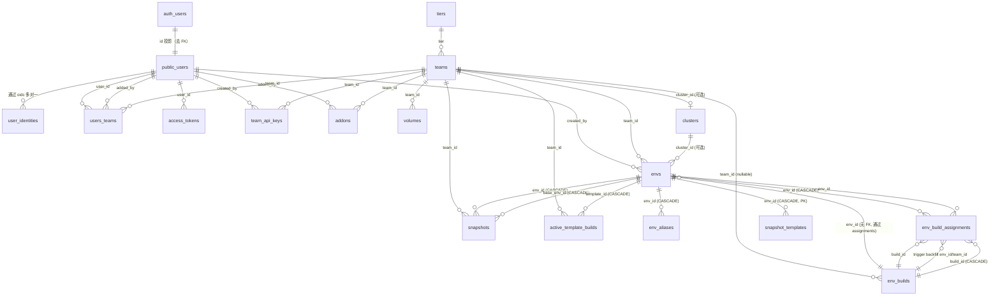

# E2B 数据库 Schema 全景

> 来源：基于 `packages/db/migrations/` 下 100+ 个 goose 迁移文件整理，反映**最终状态**（最新迁移 `20260603120000`）。
> 所有 `public.*` 表都遵循"先建表、后逐步加列/约束/索引"的演进式建模；下文"迁移轨迹"列给出了关键演进节点。

---

## 0. 顶层鸟瞰（ER 总览）



> 提示：上图是逻辑关系。物理上 `env_builds.env_id` **没有 FK 约束**（在 `20260204172712` 中被移除），env↔build 的多对多关系靠 `env_build_assignments` 表和两个 backfill 触发器维护。

---

## 1. 业务域分组

数据库按业务域自然分成 6 个簇：

| 簇 | 包含表 | 主要职责 |
| --- | --- | --- |
| **身份认证** | `auth.users`、`public.users`、`user_identities` | Supabase auth → 应用层投影；OIDC 多身份绑定 |
| **租户与权限** | `tiers`、`teams`、`users_teams` | 多租户模型 + 团队成员关系 |
| **凭据与令牌** | `team_api_keys`、`access_tokens` | 团队/用户的 API 凭证（全部 hash 化存储） |
| **模板与构建** | `envs`、`env_aliases`、`env_builds`、`env_build_assignments`、`active_template_builds` | 模板生命周期 + 构建执行 |
| **沙箱与快照** | `snapshots`、`snapshot_templates` | 沙箱状态持久化 + 快照模板 |
| **容量与基础设施** | `clusters`、`volumes`、`addons` | 编排集群、卷、附加配额 |
| **视图** | `team_limits` | tiers + addons 聚合的容量视图 |

---

## 2. 各表详细关系

### 2.1 身份认证簇

#### `auth.users`
- **位置**：`auth` schema
- **来源**：`20000101000000_auth.sql`
- **角色**：Supabase 风格的身份源（外部系统），E2B 不直接 INSERT
- **列**：`id` (uuid PK), `email`, `created_at`, `raw_app_meta_data` (jsonb), `raw_user_meta_data` (jsonb)
- **依赖**：无 FK；被 `public.users` 早期 FK 引用（已 DROP）
- **触发器**：所有早期同步触发器已在 `20260416120000` 删除；目前**完全无触发器**

#### `public.users`
- **位置**：`public` schema
- **来源**：`20251217000000_create_public_users_table.sql`
- **角色**：E2B 业务域的"用户"投影，`email` 字段已 DROP（`20260521181000`），**只剩 `id`**
- **列**：`id` (uuid PK), `created_at`, `updated_at`
- **被引用（所有 FK 都 ON DELETE CASCADE 或 SET NULL）**：
  - `user_identities.user_id`
  - `users_teams.user_id`、`users_teams.added_by`
  - `access_tokens.user_id`
  - `team_api_keys.created_by`
  - `envs.created_by`
  - `addons.added_by`

#### `user_identities`
- **位置**：`public` schema
- **来源**：`20260515120000_create_user_identities_table.sql`
- **角色**：支持 OIDC 多身份绑定（同一 user 可来自不同 IdP）
- **列**：`oidc_iss` + `oidc_sub` 复合 PK, `user_id`, `created_at`, `updated_at`
- **FK**：`user_id → public.users(id) CASCADE`
- **索引**：`user_identities_user_id_idx (user_id)`

### 2.2 租户与权限簇

#### `tiers`
- **位置**：`public` schema
- **来源**：`20231124185944_create_schemas_and_tables.sql`
- **角色**：订阅层级，定义基础配额
- **列**：`id` (text PK), `name`, `disk_mb`, `concurrent_instances`, `max_length_hours`, `max_vcpu`, `max_ram_mb`, `concurrent_template_builds`
- **CHECK**：`concurrent_instances > 0`、`disk_mb > 0`、`concurrent_template_builds > 0`
- **被引用**：`teams.tier`
- **视图**：`team_limits` 通过 JOIN tiers 计算最终配额

#### `teams`
- **位置**：`public` schema
- **来源**：`20231124185944_create_schemas_and_tables.sql`
- **角色**：租户主体
- **列**：`id` (uuid PK), `created_at`, `is_blocked`, `name`, `tier`, `email`, `is_banned`, `blocked_reason`, `cluster_id`, `slug` UNIQUE, `sandbox_scheduling_labels text[]`
- **FK**：
  - `tier → tiers(id)` (NO ACTION)
  - `cluster_id → clusters(id)` (NO ACTION，可空)
- **被引用**（共 8 个表，详见面 → 团队部分）
- **唯一约束**：`teams_slug_unique (slug)`
- **触发器**：`team_slug_trigger`（BEFORE INSERT 自动生成 slug）

#### `users_teams`
- **位置**：`public` schema
- **来源**：`20231124185944_create_schemas_and_tables.sql`
- **角色**：多对多关联 user↔team，并记录"加入者"和"默认团队"
- **列**：`uuid_id` (uuid PK, `20260316120000` 切换自原 bigint id), `user_id`, `team_id`, `is_default`, `added_by`, `created_at`
- **FK**：
  - `user_id → public.users(id) CASCADE`
  - `team_id → teams(id) CASCADE`
  - `added_by → public.users(id) SET NULL`
- **索引**：
  - `usersteams_team_id_user_id (team_id, user_id) UNIQUE`
  - `users_teams_user_id_is_default_idx (user_id) WHERE is_default = true` UNIQUE partial
  - `idx_teams_user_teams (team_id)`, `idx_users_user_teams (user_id)`

### 2.3 凭据与令牌簇

> **演进要点**：`team_api_keys` 和 `access_tokens` 都在 `2025-08~09` 完成了一轮"明文键 → hash 化"重构：原 `api_key`/`access_token` 列被 DROP，新增 `*_hash` 唯一索引，配 `*_prefix` / `*_mask_prefix` / `*_mask_suffix` 字段让 UI 仍能展示前几位+后几位。

#### `team_api_keys`
- **位置**：`public` schema
- **角色**：团队级 API 密钥
- **列**：`id` (uuid PK), `created_at`, `team_id`, `updated_at`, `name`, `last_used`, `created_by`, `api_key_hash` UNIQUE, `api_key_prefix`, `api_key_length`, `api_key_mask_prefix`, `api_key_mask_suffix`
- **FK**：
  - `team_id → teams(id) CASCADE`
  - `created_by → public.users(id) SET NULL`
- **索引**：`idx_team_team_api_keys (team_id)`、`idx_team_api_keys_api_key_hash (api_key_hash) UNIQUE`

#### `access_tokens`
- **位置**：`public` schema
- **角色**：用户级访问令牌
- **列**：`id` (uuid PK), `user_id`, `created_at`, `access_token_hash` UNIQUE, `name`, `access_token_prefix`, `access_token_length`, `access_token_mask_prefix`, `access_token_mask_suffix`
- **FK**：`user_id → public.users(id) CASCADE`
- **索引**：`idx_users_access_tokens (user_id)`、`idx_access_tokens_access_token_hash (access_token_hash) UNIQUE`

### 2.4 模板与构建簇

#### `envs`
- **位置**：`public` schema
- **角色**：**模板/沙箱的统一实体**——一个 env 既是模板定义也是可启动的沙箱
- **列**：`id` (text PK), `created_at`, `updated_at`, `public`, `build_count`, `spawn_count`, `last_spawned_at`, `team_id`, `created_by`, `cluster_id`, `source` ('template' | 'snapshot')
- **演进**：早期把 dockerfile/vcpu/ram_mb/firecracker_version 等塞在 envs 上；`20240315165236` 后这些字段**全移到 `env_builds`**，envs 变"瘦"
- **FK**：
  - `team_id → teams(id) NO ACTION`
  - `created_by → public.users(id) SET NULL`
  - `cluster_id → clusters(id)`
- **被引用**（`env_id` 是核心外键）：
  - `env_aliases.env_id CASCADE`
  - `env_build_assignments.env_id CASCADE`
  - `snapshot_templates.env_id CASCADE`（同时是 PK）
  - `snapshots.env_id CASCADE` 与 `snapshots.base_env_id CASCADE`
  - `active_template_builds.template_id CASCADE`
- **索引**：
  - `idx_envs_envs_aliases (env_id)`（在 env_aliases 上）
  - `idx_envs_team_id_source (team_id, source)`
  - `idx_envs_team_source_created_at (team_id, source, created_at DESC, id DESC)`（最新，覆盖翻页）

#### `env_aliases`
- **位置**：`public` schema
- **角色**：env 的可读别名（如 `my-template`），支持多命名空间
- **列**：`id` (uuid PK, `20260127120000` 切到 UUID PK), `alias`, `is_renamable`, `env_id`, `namespace`
- **FK**：`env_id → envs(id) CASCADE`
- **唯一约束**：`idx_env_aliases_alias_namespace_unique (alias, namespace) NULLS NOT DISTINCT`——同一 namespace 下别名唯一
- **命名空间语义**：`namespace IS NULL` 表示"被推广的公共模板"（由 `20260129105527` 数据回填）

#### `env_builds`
- **位置**：`public` schema
- **角色**：env 的具体构建产物（一个 env 可有多个 builds，每个 build 一份配置）
- **列**：`id` (uuid PK), `created_at`, `updated_at`, `finished_at`, `status` ('waiting'/'building'/'success'/...), `dockerfile`, `start_cmd`, `vcpu`, `ram_mb`, `free_disk_size_mb`, `total_disk_size_mb`, `kernel_version`, `firecracker_version`, `env_id`（无 FK）, `envd_version`, `ready_cmd`, `cluster_node_id`, `reason jsonb`, `version`, `cpu_architecture/family/model/model_name`, `cpu_flags text[]`, `status_group`, `team_id`
- **触发器**：
  - `trg_compute_status_group` —— 根据 `status` 自动维护 `status_group` 字段
  - `trigger_backfill_env_id`（在 `env_build_assignments` 上）—— 回填 `env_builds.env_id`
  - `trigger_backfill_team_id`（在 `env_build_assignments` 上）—— 回填 `env_builds.team_id`
- **索引**（侧重分页和活跃状态查询）：
  - `idx_env_builds_status (status)`
  - `idx_env_builds_status_group (status_group)`
  - `idx_env_builds_team_status_pagination (team_id, created_at DESC, id DESC) INCLUDE (status, status_group)`（覆盖索引，专门服务翻页）
  - `idx_env_builds_team_env_created_id (team_id, env_id, created_at DESC, id DESC)`
  - `idx_env_builds_team_status_group (team_id, status_group)`
  - `idx_env_builds_team_active (team_id) WHERE status_group IN ('pending','in_progress')` partial

#### `env_build_assignments`
- **位置**：`public` schema
- **来源**：`20251218160000_allow_m_n_builds_with_tags.sql`（支持 m:n 关系 + tag 维度）
- **角色**：env↔build 的多对多关系表 + 触发器回填 source
- **列**：`id` (uuid PK), `env_id`, `build_id`, `tag`, `source` ('app'/'trigger'/'migration'), `created_at`
- **FK**：
  - `env_id → envs(id) CASCADE`
  - `build_id → env_builds(id) CASCADE`
- **唯一约束**：`uq_legacy_assignments (env_id, build_id, tag) WHERE source IN ('trigger','migration')`——只对历史数据强制唯一，新插入不再有约束
- **触发器**：
  - `trigger_backfill_env_id`（AFTER INSERT，回填 `env_builds.env_id`）
  - `trigger_backfill_team_id`（AFTER INSERT，回填 `env_builds.team_id`）
- **索引**：
  - `idx_env_build_assignments_env_tag_created (env_id, tag, created_at DESC)`
  - `idx_env_build_assignments_build (build_id)`

#### `active_template_builds`
- **位置**：`public` schema
- **来源**：`20260305130000_create_active_template_builds.sql`
- **角色**：跟踪"团队当前正在构建中的模板 build 集合"，用于 `tiers.concurrent_template_builds` 配额检查
- **列**：`build_id` (PK), `team_id`, `template_id`, `tags text[]`, `created_at`
- **FK**：`template_id → envs(id) CASCADE`（`20260413120000` 加的）
- **索引**：
  - `idx_active_template_builds_team_created_at (team_id, created_at DESC)`
  - `idx_active_template_builds_template_id (template_id)`

### 2.5 沙箱与快照簇

#### `snapshots`
- **位置**：`public` schema
- **来源**：`20241213142106_create_snapshots.sql`
- **角色**：沙箱暂停时持久化的状态（auto-pause 场景）
- **列**：`id` (uuid PK), `created_at`, `env_id`, `sandbox_id` UNIQUE, `metadata jsonb` (default '{}'), `base_env_id`, `sandbox_started_at`, `env_secure`, `origin_node_id`, `allow_internet_access`, `auto_pause`, `team_id`, `config jsonb`
- **FK**：
  - `env_id → envs(id) CASCADE`
  - `base_env_id → envs(id) CASCADE`
  - `team_id → teams(id) NO ACTION`
- **触发器**：
  - `trg_sync_env_source_on_snapshot`（AFTER INSERT）—— 新快照插入时把父 env 标记为 `source = 'snapshot'`
  - `trg_snapshots_fix_json_null_metadata`（BEFORE INSERT/UPDATE）—— 把 SQL NULL 和 JSON `null` 都规整为 `'{}'::jsonb`
- **索引**：
  - `snapshots_sandbox_id_unique (sandbox_id) UNIQUE`
  - `idx_snapshots_team_time_id (team_id, sandbox_started_at DESC, sandbox_id)`（团队翻页）
  - `idx_snapshots_env_id (env_id)`
  - `snapshots_base_env_id_idx (base_env_id)`
  - `idx_snapshots_team_metadata_gin (team_id, metadata) USING GIN`（用 `btree_gin` 扩展）

#### `snapshot_templates`
- **位置**：`public` schema
- **来源**：`20260211120000_add_snapshot_templates.sql`
- **角色**：把"快照"提升为可被 spawn 的"快照模板"（`envs.source = 'snapshot'` 子集）
- **列**：`env_id` (PK + FK), `sandbox_id`, `created_at`, `origin_node_id`, `build_id`
- **FK**：`env_id → envs(id) CASCADE`
- **索引**：`idx_snapshot_templates_sandbox_id (sandbox_id)`

### 2.6 容量与基础设施簇

#### `clusters`
- **位置**：`public` schema
- **来源**：`20250606213446_deployment_cluster.sql`
- **角色**：编排集群（orchestrator 池）注册表
- **列**：`id` (uuid PK), `endpoint`, `endpoint_tls`, `token`, `sandbox_proxy_domain`, `auth_org_id`
- **唯一约束**：`clusters_auth_org_id_idx (auth_org_id) WHERE auth_org_id IS NOT NULL` partial UNIQUE
- **被引用**：`teams.cluster_id`、`envs.cluster_id`

#### `volumes`
- **位置**：`public` schema
- **来源**：`20260304120000_volumes.sql`
- **角色**：团队挂载卷
- **列**：`id` (uuid PK), `team_id`, `name` (varchar 250), `volume_type`, `created_at`
- **FK**：`team_id → teams(id)`（NO ACTION）
- **唯一约束**：`volumes_teams_uq (team_id, name)`

#### `addons`
- **位置**：`public` schema
- **来源**：`20251011200438_create_addons_table.sql`
- **角色**：在 tier 基础上加购的额外配额
- **列**：`id` (uuid PK), `team_id`, `name`, `description`, `extra_concurrent_sandboxes`, `extra_concurrent_template_builds`, `extra_max_vcpu`, `extra_max_ram_mb`, `extra_disk_mb`, `valid_from`, `valid_to`, `added_by`, `idempotency_key`
- **FK**：
  - `team_id → teams(id) CASCADE`
  - `added_by → public.users(id) NO ACTION`
- **CHECK**：`valid_to IS NULL OR valid_to > valid_from`
- **唯一约束**：`addons_idempotency_key_uidx (idempotency_key) WHERE idempotency_key IS NOT NULL` partial UNIQUE（幂等创建保护）
- **索引**：`addons_team_id_idx (team_id)`

#### 视图：`team_limits`
- **位置**：`public` schema
- **来源**：`20251011200438_create_addons_table.sql`
- **角色**：聚合 `teams` + `tiers` + 当前有效 `addons`，暴露最终配额
- **列**：`max_length_hours`、`concurrent_sandboxes`、`concurrent_template_builds`、`max_vcpu`、`max_ram_mb`、`disk_mb`
- **特性**：`security_invoker=on`——尊重调用者权限而非视图 owner

---

## 3. 关键关系详解

### 3.1 env ↔ build 的多对多（去 FK 后的反范式）

`env_builds.env_id` **没有**外键约束（`20260204172712_remove_build_assignment_triggers.sql` 移除）。原因是引入了 `env_build_assignments` 中间表后：
- 一个 env 可以选多个 builds（不同 tag 维度）
- 一个 build 可以被多个 envs 引用

完整流程：

```
用户新建 build      → INSERT env_builds (env_id=NULL)
用户为 env 选 build → INSERT env_build_assignments (env_id, build_id, tag)
                    → 触发器 trigger_backfill_env_id
                    → UPDATE env_builds SET env_id = $env_id WHERE id = $build_id
用户为 env 选 team  → INSERT env_build_assignments (..., source='app')
                    → 触发器 trigger_backfill_team_id
                    → UPDATE env_builds SET team_id = ...
```

`env_builds.env_id` 的值始终 = 该 build 被分配的**第一个** env 的 id（业务层保证）。多个 env 共享同一 build 时只记第一个。读取侧用 `env_build_assignments` 拿完整关系。

### 3.2 auth.users → public.users 的"投影"

历史轨迹：

```
20000101000000  ──  CREATE auth.users (id, email, ...)
20251217000000  ──  CREATE public.users (id, email) WITH FK auth.users(id) CASCADE
                  ──  + sync_inserts_to_public_users (auth.users AFTER INSERT)
                  ──  + sync_updates_to_public_users (auth.users AFTER UPDATE)
20260316130000  ──  DROP FK users.id → auth.users.id
                  ──  所有下游 FK 改指向 public.users.id
                  ──  触发器改绑到 public.users
20260416120000  ──  DROP 所有同步触发器
                  ──  DROP post_user_signup
20260521181000  ──  DROP public.users.email 列
```

**当前状态**：`public.users` 完全独立于 `auth.users` 的 schema 层面约束。应用层负责写入 `public.users`（典型在用户首次登录时）。`auth.uid()` 函数还留着但已无 FK 引用它。

### 3.3 配额的两层叠加

`team_limits` 视图把两层配额拼起来：

```sql
tier.max_length_hours            +  addons.extra_*  (valid_from <= now < valid_to)
tier.concurrent_instances        +  addons.extra_concurrent_sandboxes
tier.concurrent_template_builds  +  addons.extra_concurrent_template_builds
tier.max_vcpu                    +  addons.extra_max_vcpu
tier.max_ram_mb                  +  addons.extra_max_ram_mb
tier.disk_mb                     +  addons.extra_disk_mb
```

- `tier.*` 是基础包配额
- `addons.*` 是附加配额（addon 在 `valid_from..valid_to` 区间内有效）
- 用 `security_invoker=on` 视图让应用代码以调用者身份查询，避免"能看到所有团队配额"的越权

### 3.4 凭据的"hash + 显示用前后缀"模式

`team_api_keys` 和 `access_tokens` 走的是同一套设计：

| 字段 | 用途 |
| --- | --- |
| `*_hash` (UNIQUE) | 服务端校验用，bcrypt/scrypt 等单向 hash |
| `*_prefix` | 用于日志/UI 快速识别"这是 e2b_xxx 类型的 key" |
| `*_mask_prefix` + `*_mask_suffix` | UI 展示 `e2b_abc...xyz` 用，不暴露中间真实 key 段 |
| `*_length` | 校验输入长度（防御性） |
| `last_used` | 用于审计/清理策略 |

原始明文列 (`api_key`、`access_token`) 在 `20250910124212_remove_raw_keys.sql` 中**彻底 DROP**——历史数据全部在 `20250825102800_hash_existing_keys.sql` 中已 hash 化。

---

## 4. 索引策略

按"为读路径量身定做"的思路设计，主要 4 类：

| 类型 | 例子 | 服务的查询 |
| --- | --- | --- |
| **覆盖翻页索引** | `idx_env_builds_team_status_pagination (team_id, created_at DESC, id DESC) INCLUDE (status, status_group)` | 团队构建列表 API 翻页 + 排序 |
| **状态过滤 partial 索引** | `idx_env_builds_team_active (team_id) WHERE status_group IN ('pending','in_progress')` | "我们团队现在有几个 build 在跑" |
| **时间倒序 + 游标** | `idx_snapshots_team_time_id (team_id, sandbox_started_at DESC, sandbox_id)` | 团队快照列表游标分页 |
| **唯一性 partial** | `addons_idempotency_key_uidx (idempotency_key) WHERE idempotency_key IS NOT NULL` | 幂等创建 addons |

GIN 索引只有一处：`idx_snapshots_team_metadata_gin (team_id, metadata)`，依赖 `btree_gin` 扩展，用于按 metadata KV 过滤快照。

---

## 5. 触发器（最终状态）

| 触发器 | 表 | 作用 |
| --- | --- | --- |
| `team_slug_trigger` | `teams` | BEFORE INSERT 自动生成唯一 slug |
| `trg_compute_status_group` | `env_builds` | BEFORE INSERT/UPDATE OF status 维护 `status_group` |
| `trigger_backfill_env_id` | `env_build_assignments` | AFTER INSERT 回填 `env_builds.env_id` |
| `trigger_backfill_team_id` | `env_build_assignments` | AFTER INSERT 回填 `env_builds.team_id` |
| `trg_sync_env_source_on_snapshot` | `snapshots` | AFTER INSERT 把父 env 标记为 `source='snapshot'` |
| `trg_snapshots_fix_json_null_metadata` | `snapshots` | BEFORE INSERT/UPDATE OF metadata 把 SQL NULL 和 JSON null 都规整为 `'{}'::jsonb` |

> 历史上一大波 user/team 引导触发器（`create_default_team`、`post_user_signup`、auth↔public 同步三件套）已在 `20260416120000` 全部删除——应用代码现在负责这些"provision"逻辑，数据库只做约束。

---

## 6. 演进式建模的几个观察

1. **去 FK 模式**：`env_builds.env_id` 故意不挂 FK，改用 `env_build_assignments` + 触发器维护——为支持"一个 build 被多个 env 共享"的灵活性
2. **数据迁移下沉到 SQL**：每次 schema 大改都伴随"创建一次性 stored procedure → 调用 → DROP 同一 migration 内"，例如 `backfill_env_source()`、`backfill_status_group()`、`backfill_env_builds_team_id()` 等都是"用完即弃"
3. **enum 用 text + 应用层约束**：没有 `CREATE TYPE ... AS ENUM`，所有枚举列（`status`、`status_group`、`source`）都是 `text`，业务层枚举类型在 `pkg/types/` 里用 Go 强类型呈现
4. **RLS 完全缺位**：整个 schema 没有启用任何 RLS 策略——所有数据访问在应用层控制，数据库只保证约束
5. **去重列演进**：`api_key` → `id` (uuid PK) → `*_hash` (UNIQUE) 三步走，每次都先在 `ALTER TABLE` 加列、回填、改 PK/UNIQUE，最后 DROP 老列，**没有一次性"破坏性"迁移**
6. **影子 schema 兜底**：`db/schema/sqlc_overrides.sql` 是 sqlc 解析补丁，让 `billing.sandbox_logs`、`teams.slug` 等（在迁移里被包在 `DO $$` 块或用 `ALTER TABLE` 后期加的）也能被 sqlc 看到——`billing.sandbox_logs` 实际由其他服务拥有
