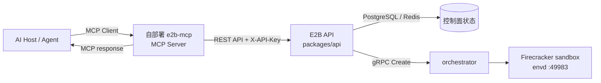
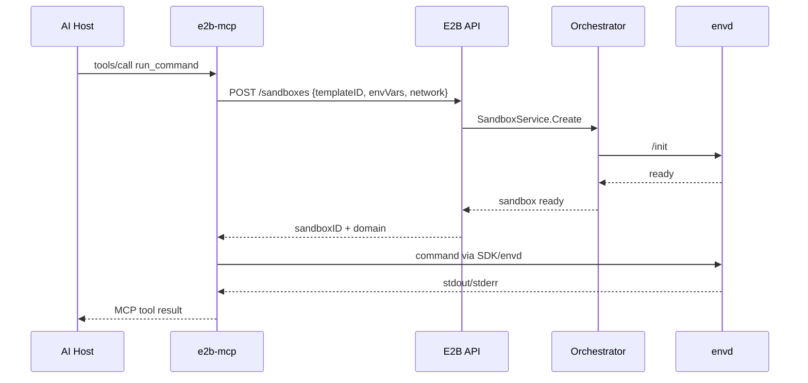

# MCP 与自部署 E2B 服务

本文解释两个容易混淆的概念：Model Context Protocol(MCP)本身，以及本仓库对
sandbox 创建请求中 mcp 字段的支持。最后把它们和“自己部署一个调用 E2B 的 MCP
服务”放在同一张架构图里。

> 结论先行：当前仓库不是 MCP Server，也没有实现 MCP 的 JSON-RPC、stdio、SSE 或
> Streamable HTTP transport。仓库里的 mcp 只是 sandbox 创建请求中的扩展 JSON；API
> 当前只记录它的顶层名称用于创建事件分析，不会启动 MCP Server，也不会把配置传给
> orchestrator。

## 1. 三个角色要分开

MCP 的基本参与者如下：

| 角色 | 责任 | 在自部署 E2B 方案中的对应物 |
| --- | --- | --- |
| Host | 承载 AI 应用，决定何时调用工具 | IDE、Agent、内部自动化平台 |
| MCP Client | 与一个 MCP Server 建立会话，发现 tools/resources/prompts | Host 内的 MCP SDK |
| MCP Server | 暴露工具协议，并把工具调用转换成实际业务操作 | 你自己部署的 e2b-mcp 服务 |

E2B 基础设施处在 MCP 之外：它负责创建 sandbox、放置到节点、启动 Firecracker VM，
并通过 envd 提供进程和文件操作。一个自部署 MCP Server 可以把这些 E2B 能力包装成
create_sandbox、run_command、read_file 等 MCP tools，但这层包装代码不在本仓库
里。



这张图里的 MCP 链路和 sandbox 数据面链路是两条不同的链路：工具调用先到 MCP
Server，MCP Server 再调用 E2B API；用户程序产生的 HTTP 流量则由 client-proxy
直接转发到 sandbox 所在节点，不会经过 Dashboard API 或 MCP Server。

## 2. 当前仓库到底支持什么

### 2.1 OpenAPI 中的 mcp 字段

spec/openapi.yml 定义了一个 Mcp 对象：

```yaml
Mcp:
  type: object
  description: MCP configuration for the sandbox
  additionalProperties: {}
  nullable: true
```

它被 NewSandbox 的 mcp 属性引用，因此创建 sandbox 时可以发送任意 JSON 对象。
生成的 Go 类型是 map[string]interface{}，这意味着 API 不校验具体的 server 名称、
URL、transport 或 credentials 结构。

### 2.2 Create 请求中的实际处理

packages/api/internal/handlers/sandbox_create.go 当前做的事情是：

1. 解析 body.Mcp，但不读取其中的 value。
2. 将整个 map 作为参数传给 startSandbox。
3. packages/api/internal/handlers/sandbox.go 的 buildCreationMetadata 只提取
   maps.Keys(mcp)，保存为 MCPServerNames。
4. packages/api/internal/orchestrator/analytics.go 在 created_instance 事件中把
   这些名称写入 mcp_servers 属性。

mcp 不会进入 SandboxMetadata，也不会进入 packages/orchestrator/orchestrator.proto
中的 SandboxConfig。因此它不会改变 VM 启动、envd 初始化、网络规则或进程环境。

| 位置 | 能观察到的 MCP 信息 | 不会发生的事情 |
| --- | --- | --- |
| API create handler | 收到一个可选的 JSON map | 不解析 server 配置 |
| 创建元数据 | 顶层 key 列表，如 filesystem、browser | 不保存 value |
| PostHog created_instance | mcp_servers: ["filesystem", ...] | 不执行 MCP tool |
| orchestrator gRPC | 没有 MCP 字段 | 不启动 MCP 进程、不注入 MCP 环境变量 |

### 2.3 生命周期边界

mcp 是创建请求的观测信息，不是 sandbox 的持久化配置。暂停后由流量自动恢复、显式
resume、connect 或 fork 的路径会以 nil MCP 元数据启动，因此恢复事件不会自动重新
带上原始 mcp_servers 列表。需要持续关联时，应使用 sandbox metadata、外部数据库或
MCP Server 自己的会话存储，而不是依赖该字段。

## 3. 自己部署 e2b-mcp 的推荐拓扑

### 3.1 MCP Server 放在 E2B 控制面之外

这是最容易隔离权限和升级的方式。e2b-mcp 是一个普通的业务服务，负责：

- 实现 MCP transport 和 JSON-RPC 生命周期；
- 校验 Host 传入的 tool 参数；
- 用服务端保存的 E2B API key 调用 POST /sandboxes、/pause、/resume 等 API；
- 通过 E2B SDK、envd Connect RPC 或 sandbox URL 完成实际操作；
- 把结果转换为 MCP 的 content 响应。

典型的工具调用顺序如下：



控制面 API 的 API key 只应存在于 e2b-mcp 的服务端 secret 中。MCP Client 不需要、也
不应该直接拿到该 key。若 e2b-mcp 运行在另一个集群，至少要允许它访问 API 的域名和
端口；sandbox 的出网规则是另一层策略，不会因为 MCP Server 能访问 API 而自动放行。

### 3.2 将 MCP Server 进程放进 sandbox

也可以把 MCP Server 作为模板中的应用进程：

1. 构建一个包含 MCP Server 二进制和配置的 template。
2. MCP Server 通过 envd 启动或由模板内的 init/systemd 启动。
3. MCP Server 监听 sandbox 内端口。
4. Host 通过 sandbox domain 访问该端口，或让外部代理把该端口转换为 MCP transport。

这种方式适合每个 sandbox 都需要一套隔离的工具依赖，但运维成本更高：每次 template
build 都可能改变 MCP Server 版本，进程日志要从 sandbox 日志链路收集，且必须处理
sandbox timeout、pause、resume 和端口重新发现。

如果入口关闭了公网访问，创建请求必须启用 secure，由 API 生成 envd access token；
外部 MCP 客户端还需要使用 sandbox traffic access token。不要把 envd token 或 traffic
token 放进公开的 MCP tool 响应。

## 4. mcp 字段应该怎么用

下面的请求是语法上可接受的示例：

```json
{
  "templateID": "team-slug/python-env:latest",
  "timeout": 900,
  "envVars": {
    "WORKSPACE": "/home/user"
  },
  "mcp": {
    "filesystem": {
      "transport": "streamable-http",
      "url": "https://mcp.example.internal/filesystem"
    }
  }
}
```

但在当前实现中，E2B API 只会把 filesystem 这个 key 记录到创建事件。transport、
url 和其他 value 不会被 API 使用；这段 JSON 不会让 sandbox 自动连接到该 MCP
Server，也不会让 sandbox 内出现名为 filesystem 的进程。

因此有两种清晰用法：

- **观测标签**：把实际使用的 MCP Server 名称作为 key，方便分析创建行为；不要把
  secret、完整 token 或高基数用户数据塞进 value。
- **业务配置**：由自部署 e2b-mcp 保存和解释。若 sandbox 内的程序也要读到配置，
  使用明确的 envVars、模板文件或启动参数，不要假设 mcp 会自动注入。

若需要在恢复后继续使用同一组 MCP Server，MCP Server 应以 sandboxID 为 key 保存
会话和配置，并在每次 resume 后重新发现 sandbox 状态。mcp 字段本身不承担这个
持久化职责。

## 5. 网络、鉴权和生命周期

### 5.1 两条网络路径

| 路径 | 目的 | 主要控制点 |
| --- | --- | --- |
| e2b-mcp → E2B API | 创建、暂停、恢复和查询 sandbox | API key、API auth middleware、服务间 TLS/防火墙 |
| Host/MCP Client → sandbox URL | 访问 sandbox 内 MCP Server 或用户服务 | client-proxy、sandbox domain、traffic token、Ingress 配置 |
| sandbox → 外部 MCP Server | 让 VM 内程序调用远端 MCP 工具 | network.egress、allow/deny domain、egress proxy |

不要把第一条路径的 API key 当作第三条路径的出网许可。allowInternetAccess=false
或 network.egress.denyOut 仍然会阻断 sandbox 的外连；需要访问外部 MCP Server 时，
应显式允许其域名，并把 DNS 解析所需的 nameserver 一并考虑进去。

### 5.2 Pause / Resume 的影响

- 完整内存 snapshot 可以保留 MCP Server 的进程内状态，但恢复仍然可能落到不同节点，
  外部连接必须可重建。
- filesystem-only snapshot 会冷启动，不能由流量自动恢复；MCP Server 必须重新启动。
- e2b-mcp 不应只在本地内存保存 sandbox 映射。至少保存 sandboxID、template/build
  版本、最后状态和重连策略。
- 对长连接 transport，resume 后重新建立 MCP session；不要假设 TCP 连接会跨 snapshot
  保持。

### 5.3 多团队部署

API 会在请求进入时按 team 鉴权，template 可见性和 sandbox 并发配额也按 team 生效。
自部署 e2b-mcp 应把 MCP 用户映射到 team/API key，而不是让所有用户共用一个无审计
的全局 key。工具层还要限制可用 template、允许的 egress 域名和命令参数。

## 6. 常见误解

### “传了 mcp，E2B 就会启动 MCP Server”

不会。当前代码只提取 map 的 key 做 analytics。MCP Server 必须由你自己的服务、模板
进程或其他部署单元启动。

### “mcp.url 会自动注入到 VM”

不会。需要注入到 VM 时使用 envVars、模板文件或显式的 envd 命令；这些配置的安全性
和生命周期由你的应用负责。

### “MCP Server 可以直接访问 orchestrator gRPC”

不建议，也不是公开边界。控制面 API 才负责 placement、配额和 Redis routing catalog；
MCP Server 应调用 API 或受支持的 SDK，而不是绕过 API 连接节点 gRPC。

### “sandbox URL 就等于 MCP endpoint”

不等于。sandbox URL 只是 client-proxy 到 sandbox 端口的路由。只有当端口上确实运行
符合 MCP transport 的服务时，它才是 MCP endpoint。

## 7. 代码阅读路线

想继续追踪这条关系时，可以按下面顺序阅读：

1. spec/openapi.yml 的 Mcp schema 和 NewSandbox.mcp 引用：确认 API 契约的宽松结构。
2. packages/api/internal/handlers/sandbox_create.go：观察 body.Mcp 在 create 请求中的
   读取时机。
3. packages/api/internal/handlers/sandbox.go：阅读 buildCreationMetadata，确认只提取
   server names。
4. packages/api/internal/orchestrator/analytics.go：查看 mcp_servers 如何进入
   created_instance analytics event。
5. packages/api/internal/orchestrator/create_instance.go 和
   packages/orchestrator/orchestrator.proto：确认 MCP 没有进入 SandboxConfig/gRPC。
6. packages/client-proxy 与 packages/envd：理解外部请求如何到达 sandbox 端口，以及
   MCP Server 进程如何被启动和访问。

把 MCP 协议实现放在自部署服务，把 sandbox 生命周期交给 E2B API，把数据面访问交给
client-proxy/envd，是这个仓库当前边界下最清楚、也最容易审计的分层方式。
