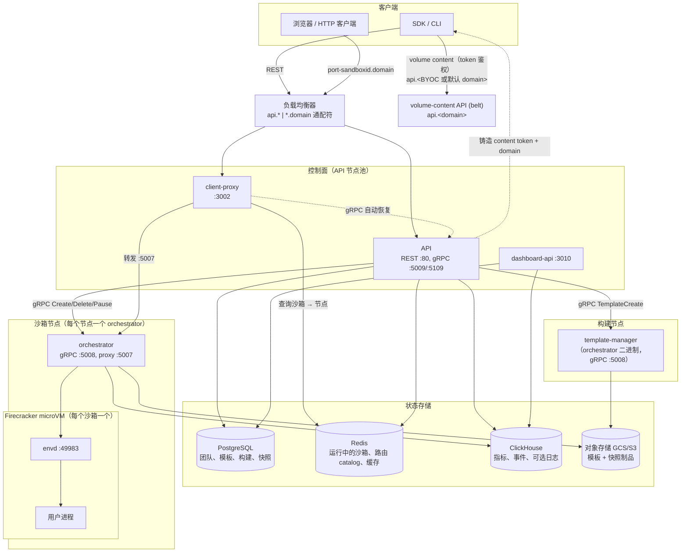
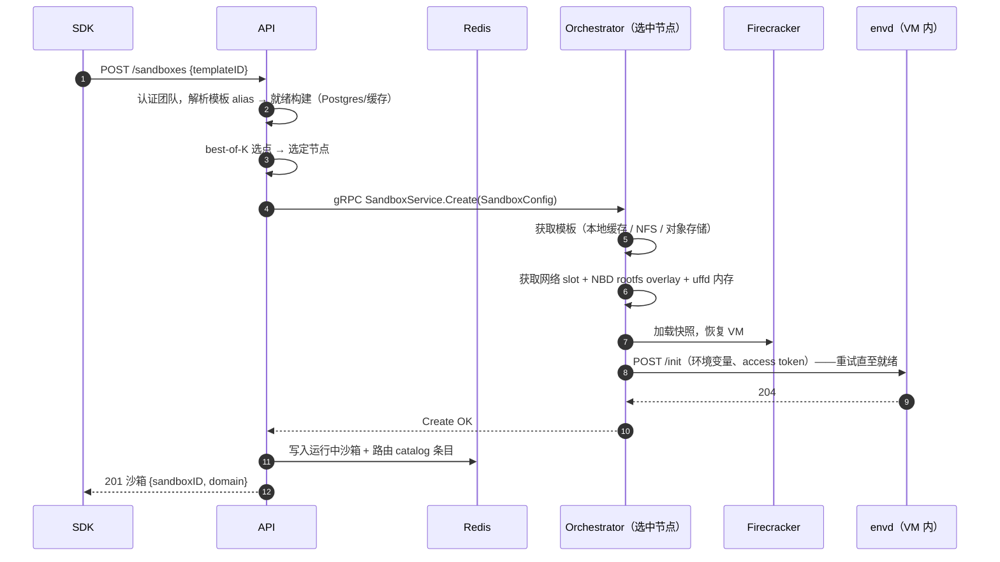
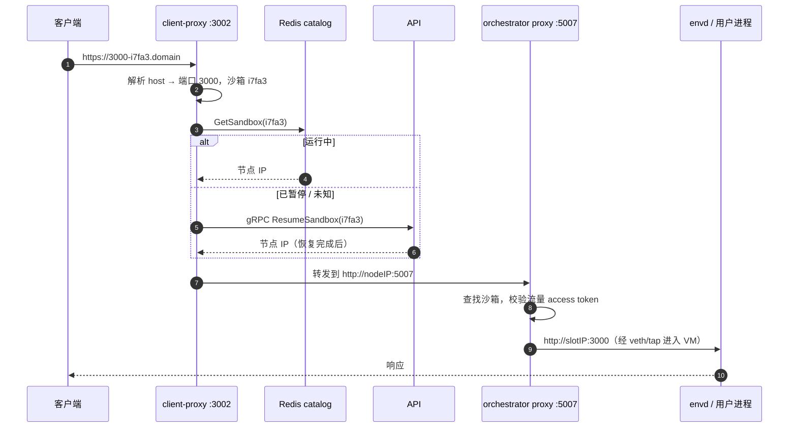
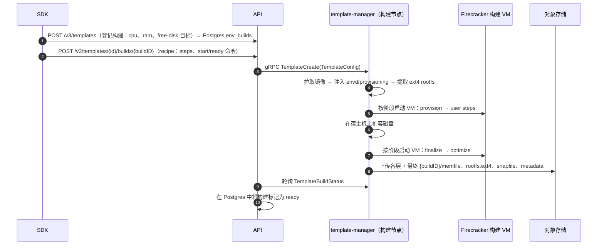
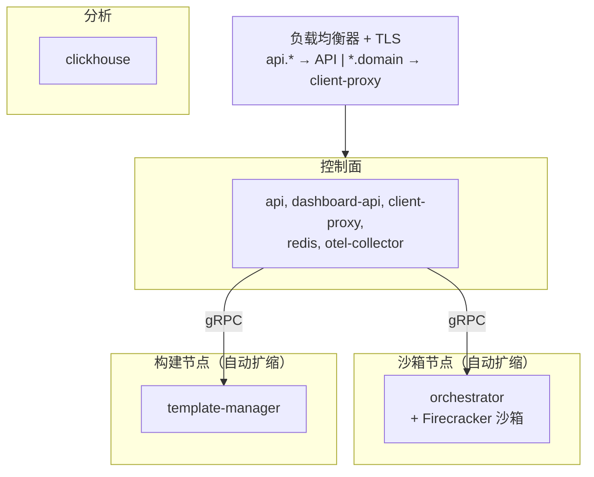

# E2B 基础设施架构总览

> 本文是 [docs/ARCHITECTURE.md](../docs/ARCHITECTURE.md) 的中文翻译，基于 tag **2026.30**（提交 `f32ee8a2a50052f32e3632ceb451111a98dd5104`）翻译于 2026-09-20。以英文原版为准；当代码变更影响原文描述时，请同步更新两份文档。
>
> ⚠️ **2026.30 对英文原文是一次近乎重写**：2026.29 是 377 行，2026.30 是 640 行（`git diff --numstat 2026.29 2026.30 -- docs/ARCHITECTURE.md` = +333/-70）。本文档已按 2026.30 原文逐节重译，与 2026.29 中文版的差异见文末 [2026.30 变动摘要](#202630-变动摘要)。

本文解释这个仓库实现了什么、每个服务的职责是什么、服务之间如何交互。在深入源码之前，它是建立全局心智模型的最快途径。

## 本仓库实现了什么

E2B 提供**沙箱（sandbox）**：几乎可以即时启动的隔离 Linux 虚拟机（它们从预启动的快照恢复，而不是冷启动），可以运行任意代码（通常由 AI agent 生成），并且可以暂停、打快照、恢复。本仓库包含完整的后端：控制面 REST API、基于 **Firecracker microVM** 的数据面 VM 编排、VM 内代理（envd）、边缘路由层，以及模板构建。

> ⛔ **2026.30 删掉了"以及部署在 GCP（AWS 处于 beta 阶段）上的 Terraform/Nomad 基础设施"这半句。** 仓库不再包含部署 IaC：`iac/`（172 个文件）与根目录 `self-host.md` 已整体删除（提交 `8a1c48884406b909f64c1239c808d0bc1cbf05bf` "chore(deploy): retire Nomad-based deployment ahead of a new deploy path"）。详见 [部署拓扑](#部署拓扑)。

两个驱动设计的核心思想：

1. **沙箱就是一次快照恢复。** 模板是预启动的 VM 快照（内存 + 磁盘 + VM 状态），存储在对象存储中。"创建"沙箱意味着恢复一个快照，这就是启动快的原因。内存页在缺页时惰性加载（userfaultfd），根文件系统是写时复制（COW）overlay，因此只有被触碰的数据才会被读取。
2. **控制面与数据面分离。** API 决定沙箱*在哪里*运行，并记录它*是否*在运行（Postgres/Redis）；每个节点上的 orchestrator 负责*如何*运行（Firecracker、网络、存储）。沙箱流量永远不经过 API。

## 系统总览



> ⛔ **与 2026.29 的图相比，2026.30 删掉了两处**：`docker push` 客户端、`docker-reverse-proxy :5000` 服务；负载均衡器注释从 `api.* | *.domain 通配符 | docker.*` 收敛为 `api.* | *.domain 通配符`。
>
> ✅ **新增一处**：独立的 `volume-content API (belt)`（标签 `api.<domain>`），以及两条数据流 `API -.->|铸造 content token + domain| SDK`、`SDK -->|volume content（token 鉴权）| VC`。见 [卷内容](#卷内容)。
>
> ⚠️ ClickHouse 的注释从"指标、事件"变为"指标、事件、**可选日志**"——日志默认仍走 Loki，ClickHouse 读路径由 flag 门控，见 [数据存储](#数据存储)。

## 服务

| 服务 | 包 | 运行位置 | 职责 |
|---|---|---|---|
| API | `packages/api` | API 节点 | 公共 REST API；沙箱生命周期、选点、认证、配额 |
| Orchestrator | `packages/orchestrator` | 每个沙箱节点 | 运行 Firecracker VM；沙箱创建/暂停/恢复/销毁 |
| Template manager | `packages/orchestrator`（角色） | 构建节点 | 从 Docker 镜像构建模板 |
| Client proxy | `packages/client-proxy` | API 节点 | 边缘路由：沙箱 URL → 正确的节点 |
| Envd | `packages/envd` | 每个 VM 内部 | VM 内代理：供 SDK 使用的进程/文件系统 API |
| Dashboard API | `packages/dashboard-api` | API 节点 | Web 控制台后端（团队、构建、管理） |

> ⛔ **`Docker reverse proxy` 这一行已在 2026.30 删除**：`packages/docker-reverse-proxy/`（19 个文件 → 0）由提交 `d153bbe9d1e2ccd5e087d7c1dece5b8974175b54`（Jakub Rojko，2026-08-06，`chore(docker-reverse-proxy): remove deprecated service`）删除，**比 `iac/` 退役早一个月**。模板基础镜像的推送不再经过本仓库的认证网关。

支撑包：`packages/shared`（proto、遥测、存储客户端、feature flags）、`packages/auth`（认证库）、`packages/db`（Postgres 迁移 + sqlc 查询）、`packages/clickhouse`（ClickHouse schema + 客户端）、`packages/otel-collector`（collector 配置）、`packages/nomad-nodepool-apm`（autoscaler 插件）、`packages/local-dev`（本地栈）。

> ⚠️ **`packages/nomad-nodepool-apm/` 仍然存在**（2026.30 仓库目录树里仍在，见 [仓库布局](#仓库布局)）。它只是一个 autoscaler 指标/目标插件，Nomad 部署路径退役并不等于这个插件被删。

### API（`packages/api`）

控制面入口（Gin，OpenAPI 从 `spec/openapi.yml` 生成，端口 80）。

- **资源**：沙箱（create/list/kill/pause/resume/connect/timeout/metrics/logs）、模板与构建、团队、卷（volume）、**API keys、secrets**、管理操作。
- **认证**（经由 `packages/auth`）：团队 API key（`X-API-Key`，`e2b_` 前缀）、认证提供方 JWT（OIDC），以及**管理员 token 或从配置的 admin JWKS 验证的 service JWT**。背后是认证数据库（Postgres）和 Redis 团队缓存。
- **Workload identity**：创建沙箱时接受一个可选的 `iam.tokens` map，键是调用方命名的 workload token 定义（每个定义包含精确的 `audience` 与 `tokenType`）。非空且校验通过的 map 会启用 workload identity；其身份由 orchestrator 从沙箱**本就权威的** team/sandbox/execution/template ID 推导而来，定义通过 `SandboxConfig.iam` 传给 orchestrator。⚠️ **API 不铸造任何凭据，也不向沙箱内投递任何东西**；基于文件的投递在准入阶段就被拒绝。定义会持久化到运行态（Redis）与暂停快照态（Postgres），因此在暂停/恢复和 orchestrator 重新同步后依然存在；**fork 会开启一个新的 workload，不继承这些定义**。
- **选点（placement）**：维护一份 orchestrator 节点的实时列表（通过 Nomad、Kubernetes 或静态列表发现）。用 **best-of-K** 算法为每个沙箱选择节点（`internal/orchestrator/placement/`）：随机抽取 K 个就绪节点，按 CPU 承诺量/使用量打分，选最低者；节点资源耗尽时重试。可通过 feature flag 在线调节。
- **状态**：把沙箱记录写入 Redis（*运行中*沙箱的事实来源），以及 client-proxy 读取的沙箱→节点**路由 catalog**（`sandbox:catalog:{id}`）。⚠️ **这条由 API 写入的记录才是默认路由来源**；orchestrator 写入的 `sandbox:routing:{id}` 是 flag 门控的备选路径（见 [沙箱路由记录](#沙箱路由记录)）。持久实体（模板、构建、快照、团队）存放在 Postgres。
- **Secrets**：`/secrets` 是密钥管理的唯一公开面（create、list、get、update、delete）。API 先用上面的客户侧凭证认证调用方，把认证得到的 team UUID 转换成后端认识的 project UUID，检查 `customer-secrets` feature flag，然后通过一元 gRPC 契约（`e2b.secretsstore.management.v1`）向 `SECRETS_STORE_BACKEND_GRPC_ADDRESS` 指定的密钥存储后端转发**仅含元数据**的请求。⚠️ **没有任何调用方凭证、header 或客户端自带的 tenant 跨过这一跳**，任何响应——包括日志、span、错误——都不携带密钥值。调用方存进去的是**运行时标记（marker）**，不是解析后的密钥；由 orchestrator-ee 在沙箱出网时把标记解析为值，**永远不在 API 这一侧解析**。未配置地址或 flag 关闭时，路由仍然注册，但一律返回 403。响应带 `Cache-Control: no-store`，请求体上限 512 KiB，值上限 64 KiB。
- **Rig 透传**：`/clusters/{clusterID}/rigs` 下的管理端点管理某个集群的 orchestrator 节点池（"rigs"）：列出 rig、调整 rig 容量、列出并终止实例、读取最近的扩缩错误。⚠️ **每个 handler 都委托给该集群的 edge 服务**（`/v1/rigs/...`），用的是集群同步持续刷新的按集群 HTTP 客户端。**API 不持有任何云凭证，也不做任何扩缩决策**；调用方用管理员凭证认证，且从不持有集群的 edge secret。edge 的状态码原样透传（400、404、409、501）。**edge 返回 401 会被转成 500**——它意味着 API 相对该集群配置错误，而不是调用方的 token 无效。未配置 rig 管理的集群返回空列表；local 集群没有 edge 部署，所有 rig 操作返回 501。
- **额外监听器**：内部 gRPC :5009 和边缘 gRPC :5109 暴露 `ResumeSandbox`，供 client-proxy 在流量到来时唤醒已暂停的沙箱。
- 从 ClickHouse 读取沙箱/团队指标端点。沙箱与模板构建**日志默认走 Loki**，另有一条 LaunchDarkly 门控的 ClickHouse 读路径（`logs-read-config`），用于日志存储迁移期间读取 local 集群日志。⚠️ `LOKI_URL` 是可选的：不配置时 API 就没有 Loki 客户端，那些读取会失败，直到 flag 把它们路由到 ClickHouse。`LOGS_READ_CONFIG=true|false` 设定 LaunchDarkly 没有值（未接 LaunchDarkly，或 flag 未在其中定义）时的回退值；LaunchDarkly 的值优先。LaunchDarkly feature flag 还控制选点参数、限流和灰度发布。

> ⛔ **资源列表里的 `access tokens` 已在 2026.30 退役**，现在是 `API keys, secrets`。完整退役过程见 [`access-tokens-module.md`](access-tokens-module.md)。
>
> ✅ **`Rig passthrough` 与 `Secrets` 是 2026.30 新增的两个小节**，`Workload identity` 也是。

### Orchestrator（`packages/orchestrator`）

一个运行在每个沙箱节点上的 Go 二进制（以 root 身份）。`ORCHESTRATOR_SERVICES` 选择其角色：`orchestrator`（运行沙箱）和/或 `template-manager`（构建模板）。代码在 `pkg/` 下，几乎全部仅限 Linux。

gRPC 服务监听 :5008（`pkg/server/`、`pkg/service/`、`pkg/template/server/`、`pkg/volumes/`）：

- **SandboxService** — `Create`、`Update`、`List`、`Delete`、`Pause`、`Checkpoint`。
- **TemplateService** — `TemplateCreate`、`TemplateBuildStatus`、`TemplateBuildDelete`（仅 template-manager 角色）。
- **InfoService** — 节点身份、角色、容量、健康状态（供 API 节点发现使用）。
- **ChunkService / VolumeService** — 节点间点对点的模板 chunk 服务；持久卷。

进程关闭由 `SIGINT`、`SIGTERM`、`SIGUSR1` 或某个服务失败触发，会先把节点切到 `ShuttingDown`，再排空构建与沙箱。⚠️ 与 `Draining` 一样，这会阻止新的选点，但已有工作仍可达，且 `/health` 返回 HTTP 200、状态为 `draining`；**与可逆的 `Draining` 不同，`ShuttingDown` 对进程是终态**，状态覆盖既不能进入也不能离开它。`FORCE_STOP` 跳过等待沙箱退出。

`InfoService.ServiceInfo` 为沙箱节点、template-builder 节点和混合角色节点上报可选的 `outstanding_work`。⚠️ 它统计的是**重叠的工作持有数**，不是不同的沙箱或构建数，并且包含被追踪的后台持久化与清理。上报节点空闲时显式发送 0；字段缺失表示未知。API 缓存这份上报，并在管理端节点列表/详情响应里以可选的顶层 `outstandingWork` 暴露，保留显式 0、省略未知计数。**这个观测计数不构成删除节点的授权。**

关键机制（都在 `pkg/sandbox/` 下）：

- **Firecracker**（`fc/`）：每个沙箱是一个 Firecracker 进程，拥有独立的 cgroup 和网络命名空间。FC HTTP API（unix socket）配置机器、磁盘、网络和快照。guest 元数据（沙箱 ID、envd access token 哈希）通过 MMDS 传入。
- **惰性内存 / UFFD**（`uffd/`）：恢复时 Firecracker 不加载内存直接还原 VM；userfaultfd 处理器直接从模板的 memfile 服务缺页中断，因此只有被触碰的页才会被读取。可选的 prefetcher 会预热已知的热点页。
- **写时复制 rootfs**（`rootfs/`、`nbd/`、`block/`）：模板 rootfs 保持只读；写入进入每沙箱独立的 COW 缓存，以 NBD 块设备的形式暴露给 Firecracker，由进程内的用户态 NBD server 提供服务。暂停时，脏块被导出为 diff。
- **模板缓存**（`template/`）：模板从对象存储惰性拉取并缓存在本地磁盘（可选共享 NFS chunk 缓存，或在 upload 完成前从其他节点点对点获取）。
- **网络**（`network/`）：每个沙箱获得一个 slot——一个包含 veth pair 和 tap 设备的网络命名空间、唯一的主机侧 IP（来自一个 /16）、NAT，以及按 slot 的 nftables 出站防火墙（含检查 SNI/Host 的 TCP 防火墙，用于域名允许/拒绝列表）。slot 池化复用；⚠️ **slot 索引改为按节点本地的 netns 状态分配**（上一次运行遗留的命名空间由启动回收流程清理）。
- **沙箱代理**（:5007，`pkg/proxy/`）：把 client-proxy 进来的流量反向代理到沙箱的 slot IP 和目标端口，走 HTTP 或配置的 HTTPS，并校验每沙箱的流量 access token。HTTPS 后端可以使用自签名证书。
- 把沙箱生命周期**事件**和 cgroup **宿主机统计**写入 ClickHouse；通过 OTel 导出指标。沙箱与模板构建日志的写入走一条由 flag 解析出的 HTTP 路由：**legacy collector 仍是回退的首选目的地**，配置的 shadow 目的地可以在 collector/存储迁移期间镜像写入，而不改变沙箱行为。

分离式的沙箱事件发布（detached publication）会持有节点工作直到发布者返回。⚠️ 这覆盖的是**投递尝试**，不是端到端投递：ClickHouse 目标只是把数据入队到内存批处理器，而该批处理器的 flush 仍算在关闭流程里。

> ⛔ **`slot 分配通过 Consul KV 协调` 这句在 2026.30 已删除**——Consul KV 不再是 orchestrator 的状态存储（见 [数据存储](#数据存储)）。
>
> ✅ **2026.30 新增三处**：进程关闭的 `ShuttingDown` 语义、`InfoService.ServiceInfo.outstanding_work` 上报、以及分离式事件发布的持有语义。

### Envd（`packages/envd`）

每个 VM 内的代理（由 systemd 在启动很早期拉起），端口 49983，chi + Connect RPC。

- **Process 服务**（`spec/process/process.proto`）：启动/列出/连接进程、流式传输 stdout/stderr、stdin、信号、PTY——这是 SDK "运行代码"的通道。
- **Filesystem 服务**（`spec/filesystem/filesystem.proto`）：stat/list/make/move/remove/watch。
- **REST**：`/health`、`/metrics`、`/envs`、`/files` 上传下载、`/init`（orchestrator 在启动/恢复后推送环境变量、access token、元数据）、`/upgrade`（在线自升级，见下）、暂停期间使用的 freeze/thaw 钩子。
- **公开路由 vs 控制面路由**：控制路由（`/init`、`/upgrade` 以及 freeze/thaw 钩子）在 `spec/envd.yaml` 里被标记为 `x-internal: true`，而 spec 并未描述的 `/upgrade` 也在 orchestrator 的 `pkg/sandbox/envd` 里与它们并列。orchestrator 经宿主网络在沙箱 slot IP 上访问它们；⚠️ **沙箱代理对所有方法一律以 404 拒绝它们**，因此它们无法通过沙箱 URL 触达。**新增一条控制路由就必须在 spec 里标记**（`go generate` 会把标记带进代理的拒绝列表）——否则它上线就是公网可达的。
- **认证**：`X-Access-Token` 头与经由 Firecracker MMDS 投递的 token 比对；文件端点使用签名 URL。⚠️ `/init` 是**豁免**的（它正是*投递* token 的那条路径），这也正是代理直接拒绝它的主要原因。
- **在线升级**（`internal/services/process/upgrade.go`）：一条需要认证的 `POST /upgrade` 让 orchestrator 在恢复时替换**运行中**沙箱里的 envd。它把新二进制流式放进请求体，envd 以**同一个 PID** `syscall.Exec` 进去，并通过一个 tmpfs 交接 blob 把工作负载的 stdio/PTY fd、进程表、最近保留的退出码和文件系统 watcher 一并带过去。⚠️ 工作负载的 cgroup 在升级后的 `/init` 恢复 access token 之前保持冻结（因此不会出现重新接管的进程未认证运行），交接结果（重新接管的进程/watcher 数以及失败项）通过那次 `/init` 的 `X-Envd-Handover` 头回传，用于全集群可见性。
- 扫描 guest 端口并转发，用户进程打开的任意端口都能通过沙箱 URL 访问。**每次行为变更必须 bump `pkg/version.go`**——API 和 orchestrator 会按每次模板构建记录的 envd 版本做特性门控。

> ✅ **2026.30 新增**：`/envs` 端点、"公开路由 vs 控制面路由"小节、以及 envd 在线升级（`POST /upgrade`）。

### Client proxy（`packages/client-proxy`）

所有沙箱流量的无状态边缘（端口 3002；健康检查 3003）。终结 `https://<port>-<sandboxID>.<domain>` 请求（host 解析在 `packages/shared/pkg/proxy/host.go`），在 Redis **路由记录**中查找沙箱所在节点，然后默认反向代理到该节点 orchestrator 的 :5007。⚠️ 当节点代理监听在别处时，用 `ORCHESTRATOR_PROXY_PORT` 选择不同的下游端口。如果沙箱不在记录中（已暂停），它调用 API 的 `ResumeSandbox` gRPC 并重试——已暂停的沙箱在流量到来时透明唤醒。默认读取的是 API 持有的 `sandbox:catalog:{id}`；`orchestrator-routing-prioritized` flag 会把读取切到 orchestrator 持有的 `sandbox:routing:{id}`（见 [沙箱路由记录](#沙箱路由记录)）。

### Dashboard API（`packages/dashboard-api`）

独立的 REST 服务（端口 3010，spec 为 `spec/openapi-dashboard.yml`），由 Web 控制台而非 SDK 消费：legacy 团队管理/开通、模板 tag、构建列表、admin 引导。其管理路由接受共享的 admin token，或一个**对配置的 admin JWKS 验签的短生命周期 service JWT**。⚠️ `disable-legacy-team-mutations` LaunchDarkly flag 在认证**之后**以 412 拒绝 legacy 生命周期写入；它不影响读，也不影响 workspace API 的管理投影写入。团队范围的模板与构建读路由接受 dashboard 用户认证或团队 API key 认证（`X-API-Key`）。其与 workspace 无关的 `/v1/management` 操作定义在同一份 dashboard OpenAPI 契约里，并注册在既有 router 上；它们的 `AdminJWTAuth` OpenAPI security scheme **只接受对 workspace-api `/.well-known/jwks.json` 验签的短生命周期 service JWT**，可接受的签名算法由每个 JWK 必填的 `alg` 元数据推导。issuer 与 audience 通过 JSON 的 `ADMIN_AUTH_PROVIDER_CONFIG` 配置——与 `AUTH_PROVIDER_CONFIG` 同一套配置结构。对接 Postgres 和 ClickHouse；从不与 orchestrator 通信。

issuer 通常至少配置一个可接受的 audience，把 JWT 绑定到它预期的目标。⚠️ 只有**同时不配置 `audienceMatchPolicy`** 时，issuer 才可以省略 `audiences`；这是刻意关闭 audience 匹配，而 issuer、签名与时间声明校验仍然必填。

`/v1/management` 操作是"集群侧"对一份由 workspace residency 持有的契约的实现：project upsert（一个 project 就是一行 `public.teams`，由调用方提供的 UUID 创建；tier 只在创建时从本地默认值分配一次，之后没有任何推送会改动它；slug 变更会重命名 project，其他东西都不跟着变）、按成员投影、以及 limit 同步（写入 `project_limits`，`team_limits` 视图优先读它而不是 `tiers`）。它们全部幂等，因为调用方是电平触发（level-triggered）并会重试。`PUT /v1/management/projects/{projectID}/members/{userID}` 应用单个用户的期望存在性，由存在 `projection.project_members` 的按 project/user 单调 revision 门控；重复或更旧的 revision 直接成功且不改变目标状态。`PUT /v1/management/projects/{projectID}/limits` 用同样的方式门控，由 `projection.project_limits` 里按 project 的单调 revision 把关：调用方一旦为某个 project 解析出的 limit 发生变化就抬高它，而**投递 revision 小于等于已记录 revision 会被丢弃，并且仍然返回 204**。账本与 `public.project_limits` 里的值在同一个事务里推进，因此**绝不会出现记录了 revision 却没有记录它所准入的值**。两道栅栏都属于目标端，存在的原因也相同——调用方只能给"自己发出的东西"加栅栏，所以两次在途投递会按网络给出的顺序到达，较旧的那次必须在落地处被拒绝。投影存在时会带上该 User 的 OIDC issuer/subject 身份。每个被投影的 user 至少有一个身份，已被其他 user 占用的身份返回 409。撤销只删除该 User 的 `users_teams` 行；被投影的 User 与身份保留。成员写入逻辑住在 `internal/management`（连同其提交后缓存驱逐），而不在 handler 里：认证会缓存成员授权，因此每条被接受的命令都要在提交后失效该 User 对该 Project 的授权。

管理面还拥有一套**可安全重放的集群生命周期**：调用方用一个稳定的集群 UUID 注册不可变的连接信息，把它只分配给指定的 project，在 provider 清理前**精确地**解除该分配，并且只有在没有任何 project 引用它之后才删除集群。重放同一个注册或分配会成功；而描述符变化、分配给不同的 project、不精确的解除、或删除仍被引用的集群，都会返回冲突。

`DELETE /v1/management/projects/{teamID}` 已声明但返回 501。⚠️ `envs`、`snapshots`、`volumes` 以 `ON DELETE NO ACTION` 引用 `teams`，且模板只是软删除，因此**只要一个 project 曾经构建过模板，它的 team 行就被钉住**——而释放它需要 API 服务的 orchestrator 连接，这个服务没有。今天不从控制面删除 project。

> ✅ **Dashboard API 一节在 2026.30 大幅扩写**：admin JWT/JWKS、`disable-legacy-team-mutations`、`/v1/management` 契约与 revision 栅栏、集群生命周期、`DELETE` 返回 501。2026.29 的中文版只有一句话。

## 数据存储

| 存储 | 所属包 | 存放内容 |
|---|---|---|
| **PostgreSQL** | `packages/db`（goose 迁移、sqlc） | 持久控制面状态：`teams`、`users`、`tiers`（配额默认值）、`project_limits`（由拥有方服务推入的按团队配额覆盖；`team_limits` 视图优先读它而不是 `tiers`）、`envs`（模板）、`env_builds`（构建行：vcpu、ram_mb、status、versions）、`env_aliases`、`snapshots`（已暂停沙箱）、`team_api_keys`、`volumes`、`clusters` |
| **Redis** | API、client-proxy、orchestrator | 短暂运行时状态：运行中沙箱存储（事实来源）、沙箱→节点路由 catalog、团队/模板/快照缓存、限流、P2P chunk peer 注册 |
| **ClickHouse** | `packages/clickhouse` | 时序/分析：`metrics_gauge`/`metrics_sum`（由 OTel collector 写入）、`sandbox_events`、`sandbox_host_stats`（由 orchestrator 写入）、团队指标，以及日志迁移期间可选的 `sandbox_logs`。由 API 和 dashboard-api 读取 |
| **对象存储**（GCS/S3/本地，`packages/shared/pkg/storage`） | orchestrator、template-manager | 模板与快照制品，按 build ID 组织：`{buildID}/memfile`、`{buildID}/rootfs.ext4`、`{buildID}/snapfile`、`{buildID}/metadata.json` + `.header` 索引文件 |

模板和已暂停沙箱的快照具有**相同的制品形态**——快照就是一个新的 build，其 memfile/rootfs 以相对所属模板的 diff 形式存储（diff 链通过 `.header` 文件解析）。

> ⛔ **2026.30 从本表删掉/改掉三处**：
> - **`Consul KV` 整行删除**。orchestrator 不再用 Consul KV 做跨重启的网络 slot 分配（改为按节点本地 netns 状态分配，见 orchestrator 的**网络**条目）。
> - PostgreSQL 列表里的 **`access_tokens` 已删除**（表由迁移 `20260823120000_drop_access_tokens.sql` DROP）。
> - ClickHouse 描述新增"**以及日志迁移期间可选的 `sandbox_logs`**"，与架构图里"可选日志"的注释对应。
>
> ✅ **新增**：PostgreSQL 列表里的 `project_limits`（与 dashboard-api 的 limit 同步契约对应）。

## 核心流程

### 沙箱创建



API 在 gRPC `Create` 上阻塞，而 gRPC `Create` 又阻塞在 envd 的 `/init` 上——当客户端收到响应时，沙箱已完全可用。全新创建内部其实是模板基础快照的一次*恢复*。⚠️ **冷启动只发生在纯文件系统模板/构建，或显式 resume 请求冷启动时**（见下面的暂停与恢复）；**模板创建永远不会冷启动**。

### 沙箱流量



### 沙箱路由记录

client-proxy 从 Redis 里的一条**路由记录**解析沙箱所在节点的 IP。⚠️ **今天同时存在两条记录**，它们的 JSON 形状相同（`packages/shared/pkg/sandbox-catalog` 里的 `sandbox_catalog.SandboxInfo`）：`orchestrator_id`、`orchestrator_ip`、`execution_id`、`sandbox_started_at`、`sandbox_max_length_in_hours`。

| 记录 | Key | 写入者 | 写入时机 | 删除时机 |
|---|---|---|---|---|
| API 持有（默认） | `sandbox:catalog:{sandboxID}` | API（cloud）或集群 edge（BYOC，从 gRPC metadata 取） | `Create` 返回之后 | 在向节点发送 `Pause`/`Kill` 之前 |
| Orchestrator 持有（v1，flag 门控） | `sandbox:routing:{sandboxID}` | orchestrator，`packages/orchestrator/pkg/routing` | `MarkRunning` 时（沙箱进入 live map、envd 就绪） | `MarkStopping` 时（kill、pause、checkpoint、crash） |

⚠️ **API 持有的记录仍然是事实来源。** 除非 `orchestrator-routing-prioritized` flag 打开，client-proxy 都读 `sandbox:catalog:{id}`。orchestrator 持有的记录是一条 **v1 测试路径**：它与 API 路径并行运行，尚未取代它。

`packages/shared/pkg/featureflags` 里有两个 flag 控制这条新路径：

- `orchestrator-routing-publish`（orchestrator）：在 `MarkRunning` 时写 `sandbox:routing:{id}`，在 `MarkStopping` 时删除。⚠️ 写入失败只记日志并计数（`orchestrator.routing.publish.total{result=error}`），**沙箱继续运行**。构建沙箱被跳过。删除操作在 Lua 脚本里用 `execution_id` 做守卫，因此一次过期的生命周期绝不会删掉更新执行的记录。
- `orchestrator-routing-prioritized`（client-proxy）：从 `sandbox:routing:{id}` 而不是 `sandbox:catalog:{id}` 解析节点。⚠️ **miss 时不会回退到 API 持有的记录**，而是走自动恢复路径（向 API 发 `ResumeSandbox` gRPC），与今天一致。

上线顺序：先开 `orchestrator-routing-publish`，等一个最大沙箱时长，让每个存活沙箱都有记录；再开 `orchestrator-routing-prioritized`。回滚只需关掉 `orchestrator-routing-prioritized`，API 路径未受影响。

两条记录的 TTL 都是从写入时刻起算的 `sandbox_max_length_in_hours`。⚠️ 在每条正常停止路径上，记录都会**更早**被删除。

> ✅ **本节是 2026.30 新增**。2026.29 只有一句"client-proxy 在 Redis 路由 catalog 中查找沙箱所在节点"。

### 卷内容

持久卷（`packages/orchestrator/pkg/volumes/`）通过控制面 API 管理（`POST/GET /volumes`），但它们的**内容**——读写文件——由一个独立的 volume-content API（belt，`e2b-dev/belt`）提供，SDK 直接与它通信，不经过控制面 API。API 的角色是**铸造凭据并告诉 SDK 把内容流量发到哪里**。

```mermaid
sequenceDiagram
    autonumber
    participant U as SDK
    participant API as API
    participant PG as PostgreSQL
    participant VC as volume-content API (belt)

    U->>API: POST /volumes（创建）或 GET /volumes/{id}
    API->>PG: 持久化 / 读取 volume 行
    API->>API: 铸造 JWT（aud = https://api.&lt;domain&gt;）<br/>解析 domain
    API-->>U: { volumeID, name, token, domain? }
    Note over U: domain 只对 BYOC 团队返回；<br/>SDK 保存它，否则回退到 api.&lt;E2B_DOMAIN&gt;
    U->>VC: /volumecontent/{id}/... 打到 api.&lt;domain&gt;<br/>Authorization: Bearer token
    VC->>VC: 校验 token（audience 必须与自身 origin 匹配）
    VC-->>U: 文件内容
```

- **domain 选择**：token 的 audience 与内容主机是**同一个 origin**，`https://api.<domain>`。对于在**自定义（BYOC）集群**上的团队（`team.ClusterID` 已设置），API 返回该集群的 domain（`cluster.SandboxDomain`，在 `handlers.volumeContentDomain` 里解析），因此内容流量打到 BYOC 集群的 edge 而不是控制面主机。对于默认集群上的团队，响应省略 `domain`，SDK 使用它自己配置的默认值（`api.<E2B_DOMAIN>`）；此时 audience 用部署的 `DOMAIN_NAME`。
- **token**：一个短生命周期 JWT（`handlers.generateVolumeContentToken`，配置在 `cfg.VolumesTokenConfig`），由 API 签名，作用域限定到团队与卷，在每次内容请求上作为 bearer token 出示。⚠️ 它的 `aud` claim 是 `https://api.<domain>`，因此**为某个集群 origin 铸造的 token 不会被另一个集群接受**。

> ✅ **本节与 `volume-content API (belt)` 都是 2026.30 新增**，2026.29 的架构图与正文里完全没有。

### 暂停与恢复

- **暂停**：API 在 Postgres 记录一条快照行，然后向节点发送 gRPC `Pause`。orchestrator 暂停 VM、打快照，将内存（脏页追踪）和 rootfs（COW 缓存）相对模板做 diff，快照先缓存到本地，再异步上传到对象存储（有重试预算）。沙箱从 Redis catalog 中移除。
  - **延迟 rootfs 导出**（由 `packages/shared/pkg/featureflags` 的 `deferred-rootfs-export` flag 门控）：不在暂停关键路径上做 rootfs diff，而是暂停时**弹出**可写 COW 缓存就返回，随后在后台把它封成 rootfs diff（reflink）。⚠️ 这把 rootfs diff 的延迟挪出了暂停，但本地快照的 rootfs body 在封存完成前并未物化，因此**异步上传——以及任何读取 rootfs diff 的原节点恢复/prefetch——都要等封存**。封存失败是**永久性**的（不会重跑），所以上传会快速失败而不是重试。
- **恢复**：与创建同一路径，但选点优先**原节点**——如果快照还在其本地缓存中，恢复可以完全避免读对象存储。`Checkpoint` 是原地暂停+恢复，用于在不中断运行的情况下持久化状态。
- **显式纯文件系统恢复**：resume/connect 上的 `memory: false` 要求冷启动（`RebootSandbox`），即使快照包含内存——这是当恢复出的内存状态不可用时的一条**自助救援**通道。按团队由 `fs-only-resume-api` flag 门控；关闭时请求被显式报错拒绝，**绝不静默降级为内存恢复**。⚠️ 磁盘具有崩溃恢复语义（暂停前未 flush 的写入会丢失），不改变任何持久数据（内存快照原封不动），且**自动恢复永远不走这条路径**——流量永远走内存恢复。一个偏好内存的沙箱唯一会以纯文件系统快照收场的时机是**暂停时而非恢复时**：当节点在重试预算内（从第一次拒绝起算，`auto-pause-overstay-budget-milliseconds`，默认 120 s；0 表示第一次拒绝就降级，负数表示永不降级）持续拒绝一次超时自动暂停（其父 memfile header 在准入宽限期后仍在去重）时，evictor 改为请求纯文件系统快照，让沙箱不再超期滞留；该快照的下一次恢复就是冷启动。⚠️ **降级只在同一次扫描中的一次拒绝上决定**，所以仅仅 eviction 滞后绝不会降级任何东西，而拒绝只有在 `pause-refusal-restore` 打开时才会留存。在 BYOC 集群上，该 flag 还要求**每个 edge 副本都运行在"拒绝后恢复路由"的版本**上：先把 edge 完整滚动一遍，回滚 edge 前要对该集群关闭该 flag——集群模型里没有任何东西能检查 edge 的版本。
- **预启动文件系统恢复**：每次冷启动一个在暂停时**未**冻结的 rootfs（`fs_quiesced` 为 false/缺失）都会在 VM 启动前跑一次受限的 `e2fsck -p -E journal_only`——只做 journal replay，与 guest 内核在 mount 时会做的恢复相同——因此 `memory: false` 救援与 legacy 同步回退产生的纯文件系统快照都能挂上一个一致的磁盘。⚠️ 它只 replay 然后退出，不做完整一致性扫描，所以**成本由 journal 内容决定，而不是文件系统大小**。它与离线 envd 替换受同样的限制（非特权 transient unit，设备访问被钉在沙箱自己的 NBD 节点上）。replay 干净则启动；其他任何结果都会让启动失败，但**快照保持原样且仍可重试**。⚠️ **journal replay 永远不会判死一个快照**：它的退出码无法区分"文件系统不可挂载"和"瞬时设备故障"，所以所有非干净 replay 的结果——操作失败（超时、I/O、设备错误）或不是干净 replay 的 e2fsck 退出码——都是可重试的，绝不是面向客户的永久判定。能挂载的文件内损坏同样不判死——replay 不扫描，所以它能启动。整盘修复与判死 rootfs 留给另一条可选的完整文件系统修复路径。由 `preboot-fs-recovery` flag 门控，⚠️ 它与 `fs-only-resume-api` **分开**，因为它还会改变既有纯文件系统冷启动的行为。
- **恢复时的 envd 在线升级**：orchestrator 可以在恢复期间把沙箱的 envd 升级到更新的节点本地构建（由 `packages/shared/pkg/featureflags` 的 `envd-upgrade-target` flag 门控），走 envd 的 `POST /upgrade`（见 envd 一节）。它是 best-effort 的——`exec` 之前的投递失败会让旧 envd 继续服务——**但 `exec` 之后不可恢复的失败例外**（新 envd 再也无法重新初始化），此时恢复失败，而不是返回一个永久不可用的沙箱。
- **冷启动恢复时的 envd 离线升级**：用于 envd 太旧、无法参与在线 `/upgrade` 交接的场景（低于 `MinEnvdVersionForUpgrade`）。当**纯文件系统**快照冷启动（`RebootSandbox`）时，orchestrator 在 VM 启动**之前**改写 rootfs 里的 `/usr/bin/envd`（`PreBootFn` → `pkg/sandbox/rootfs.SwapEnvdBinary`），全程在用户态通过受限的 `debugfs` 完成——**绝不在宿主机内核上 mount 租户镜像**。旧 envd 从不参与，因此该方法与版本无关。由 `envd-offline-upgrade-target` flag 门控（`envd-upgrade-target` 的姊妹 flag，共用同一个版本重映射解析器），且仅在快照的 rootfs 是冻结态捕获时应用（`fs_quiesced`，因而崩溃一致）；best-effort（替换失败就用原 envd 启动）。⚠️ 因为替换以快照的 *built-with* 版本为键、且不会推进它，所以它会在每次冷启动恢复时**幂等地反复触发**，直到一次重新暂停把运行版本重新烘焙进去。
- **两条升级路径都通过一个节点本地缓存读取宿主机 envd 二进制**（由 `envd-binary-cache` flag 门控）：版本探测、在线投递和离线替换的暂存副本都读本地副本，而不是那个只读制品挂载点——否则一次 `exec` 会以小的随机读把它按需换页进来。这个缓存正是两条路径都不会在恢复路径上对该挂载点做批量 I/O 的原因。

  它给两条路径都加了第三个条件，所以一个符合条件的快照不会被无条件升级：⚠️ **二进制在本节点未缓存的升级会被推迟到之后某次恢复**，而不是从挂载点读取——因为在那里读会给客户正在等待的路径加上几十秒。缓存冷的节点（任何 miss，尤其是以 sandbox 或 team 为键的 ramp——那种情况下启动预热不会求值）会推迟该升级，同时后台预热填充缓存；在节点范围的规则上，启动预热通常会在第一次恢复前完成。两次升级都幂等且每次恢复重新触发，所以一次推迟只代价一个周期。⚠️ 请在**节点范围**的 context kind 上 ramp 这个 flag——缓存是被该节点上每个沙箱共享的。
- 自动暂停/自动恢复让沙箱事实上 serverless 化：空闲沙箱暂停，流量到来时恢复（见上面的流量流程）。

> ✅ **本节是 2026.30 扩写最猛的一节**。2026.29 只有两条 bullet（暂停、恢复）；2026.30 新增了延迟 rootfs 导出、显式纯文件系统恢复、预启动文件系统恢复、envd 在线升级、envd 离线升级、envd 二进制缓存共六个子条目。

### 模板构建



构建是**分层的**（`pkg/template/build/phases/`）：base → user → 每个 recipe step 一层 → 扩容磁盘 → finalize → optimize。每层都有哈希并缓存，因此重建只重跑有变化的 step。扩容磁盘在宿主机上对静止的 rootfs 操作；其他未命中缓存的阶段在真实 Firecracker VM 中运行，其暂停 diff 就成为新的层。optimize 阶段记录一次全新恢复会触碰哪些内存页，生成 prefetch 提示，加速后续沙箱启动。

模板创建会跨前台 setup 与异步构建完成**持有节点工作**，包括层上传、同步清理和最终状态发布。⚠️ 取消可以在执行结束前就把构建标记为失败，但**工作持有会一直保留到执行退栈**。模板删除拥有一个独立的持有，直到制品清理返回。

> ⛔ **2026.30 从本流程图删掉了 `docker push` / `docker-reverse-proxy` 参与者与那个 `opt 自定义基础镜像` 分支**；`POST /v3/templates` 的登记参数新增了 **free-disk 目标**。
>
> ✅ **新增**：末尾关于"模板创建/删除持有节点工作"的一段。

## 部署拓扑

这些服务是与调度器无关的二进制和容器；⚠️ **官方支持的运行方式是 Kubernetes 发行版**。以下角色划分与节点如何被供给无关。



- **控制面服务**（api、dashboard-api、client-proxy）是无状态容器，也是负载均衡器唯一的后端。api 通过 `packages/shared/pkg/servicediscovery`（支持 Kubernetes、DNS、静态列表，或代码仍然携带的 **legacy Nomad** 后端）发现 orchestrator 节点。
- **沙箱节点**直接在宿主机上运行 orchestrator（它需要 root 权限来操作 Firecracker、命名空间、NBD、cgroups），配置了 hugepages 和本地模板缓存。自动扩缩。
- **构建节点**以 template-manager 模式运行同一个二进制。
- PostgreSQL 是外部服务（连接串经 secrets 下发）；Redis 是托管服务或集群内的单实例；ClickHouse 运行在自己的节点上。
- 可观测性：所有服务导出 OTel；collector 分发到 ClickHouse（产品指标）和 Grafana Cloud/stack。日志默认走 legacy 的 Vector → Loki 路径；动态日志路由可以选择一个主 collector 和若干 shadow collector，且在 `sandbox_logs` 被填充后，local 集群的日志读取可以用 `logs-read-config` 切到 ClickHouse（`LOGS_READ_CONFIG` 是 LaunchDarkly 没有值时的回退）。⚠️ **一旦读取切到 ClickHouse，部署里就可以不带 Loki，api 也可以在缺少 `LOKI_URL` 的情况下启动。**

> ⛔ **本节在 2026.30 被整段重写**。2026.29 的写法是"使用 **Terraform**（`iac/provider-gcp/`、`iac/provider-aws/`）部署到 **Nomad + Consul** 集群"，配套的 Mermaid 图里有 server 池（Nomad + Consul server）、api 池（含 Traefik ingress、docker-reverse-proxy、loki、autoscaler）、default 池、build 池、clickhouse 池，以及 `NS -.->|调度 job| ...` 这条边。
>
> 2026.30 把这些全部换成"调度器无关的二进制/容器 + 官方支持的 Kubernetes 发行版"四池图（控制面 / 沙箱节点 / 构建节点 / 分析），并删掉了 Nomad job spec 路径 `iac/modules/job-*/jobs/*.hcl`、Consul DNS（`*.service.consul`）、`raw_exec` system job、以及"`nomad-nodepool-apm` autoscaler 插件随节点池扩缩该 job"的表述。
>
> 相关删除（仓库层面，提交 `8a1c48884406b909f64c1239c808d0bc1cbf05bf`）：`iac/`（172 文件）、根目录 `self-host.md`；根 `Makefile` 移除了所有 Terraform/Nomad 目标；`.github/workflows/` 移除了 `publish.yml`、`release-please.yml`、`validate-iac.yml`、`build-and-upload-images.yml`。
>
> ⚠️ **`packages/docker-reverse-proxy/`（19 文件 → 0）不是这个提交删的。** 它由更早的独立提交 `d153bbe9d1e2ccd5e087d7c1dece5b8974175b54`（Jakub Rojko，2026-08-06，`chore(docker-reverse-proxy): remove deprecated service`）删除。`8a1c4888` 只是随 `iac/` 整棵树带走了它的两个部署文件（`iac/provider-gcp/docker-reverse-proxy.tf`、`iac/provider-gcp/nomad/jobs/docker-reverse-proxy.hcl`）。两者相差一个月，别合并成一次删除。

## 仓库布局

```
packages/
  api/                  控制面 REST API
  orchestrator/         沙箱运行时 + 模板构建器（一个二进制，按节点部署）
  client-proxy/         沙箱流量的边缘路由
  envd/                 VM 内代理（行为变更必须 bump pkg/version.go！）
  dashboard-api/        Web 控制台后端
  shared/               Proto、遥测、存储客户端、proxy 引擎、feature flags
  auth/                 认证库（API key、JWT/OIDC），供 api + dashboard-api 使用
  db/                   Postgres 迁移（goose）+ 查询（sqlc）
  clickhouse/           ClickHouse schema、批量写入器、查询客户端
  otel-collector/       Collector 配置
  nomad-nodepool-apm/   Nomad autoscaler 指标插件与部署感知 target 插件
  local-dev/            docker-compose 本地栈 + DB 种子数据
spec/                   OpenAPI spec（公共、edge、dashboard）——代码生成源
tests/integration/      针对真实部署的集成测试
```

跨服务契约全部由生成代码保证：OpenAPI spec 在 `spec/`，gRPC proto 在 `packages/orchestrator/*.proto` 和 `packages/envd/spec/`，SQL 在 `packages/db/queries/`。修改任何一处之后运行 `make generate`。

> ⛔ **2026.30 从目录树里删掉了两行**：`docker-reverse-proxy/`（仓库认证网关）与 `iac/`（Terraform + Nomad job）。
>
> ✅ **`nomad-nodepool-apm/` 仍在树里**（只是插件，不代表 Nomad 部署路径仍在）。
>
> ✅ **新目录 `packages/shared/pkg/servicediscovery/`**（2026.30 新建，2026.29 完全不存在）承载 Kubernetes/DNS/静态列表/legacy Nomad 四种节点发现后端，被 [部署拓扑](#部署拓扑) 引用。

## 2026.30 变动摘要

按"新增 / 删除 / 改写"归类，便于对照 2026.29 中文版阅读：

| 类别 | 变动 | 位置 |
|---|---|---|
| ⛔ 删除 | "以及部署在 GCP（AWS 处于 beta 阶段）上的 Terraform/Nomad 基础设施"半句 | [本仓库实现了什么](#本仓库实现了什么) |
| ⛔ 删除 | 架构图里的 `docker push` 客户端与 `docker-reverse-proxy :5000`；LB 注释去掉 `docker.*` | [系统总览](#系统总览) |
| ⛔ 删除 | 服务表里的 `Docker reverse proxy` 行 | [服务](#服务) |
| ⛔ 删除 | API 资源列表里的 `access tokens` | [API](#apipackagesapi) |
| ⛔ 删除 | 网络 slot 的 Consul KV 协调 | [Orchestrator](#orchestratorpackagesorchestrator) |
| ⛔ 删除 | 数据存储表里的 `Consul KV` 行、PostgreSQL 的 `access_tokens` | [数据存储](#数据存储) |
| ⛔ 删除 | 模板构建流程里的 `docker push` / `docker-reverse-proxy` 分支 | [模板构建](#模板构建) |
| ⛔ 删除 | 整节 Terraform/Nomad/Consul 部署拓扑（换成调度器无关 + Kubernetes） | [部署拓扑](#部署拓扑) |
| ⛔ 删除 | 仓库布局里的 `docker-reverse-proxy/`、`iac/` | [仓库布局](#仓库布局) |
| ✅ 新增 | `volume-content API (belt)` + 两条数据流 | [系统总览](#系统总览)、[卷内容](#卷内容) |
| ✅ 新增 | API 的 Workload identity、Secrets、Rig 透传三个小节 | [API](#apipackagesapi) |
| ✅ 新增 | Orchestrator 的 `ShuttingDown` 关闭语义、`outstanding_work` 上报、分离式事件发布 | [Orchestrator](#orchestratorpackagesorchestrator) |
| ✅ 新增 | Envd 的 `/envs`、公开 vs 控制面路由、`POST /upgrade` 在线升级 | [Envd](#envdpackagesenvd) |
| ✅ 新增 | 沙箱路由记录整节（双记录表 + 两个 flag + 上线顺序） | [沙箱路由记录](#沙箱路由记录) |
| ✅ 新增 | 暂停与恢复的六个子条目（延迟 rootfs 导出、纯文件系统恢复、预启动 fsck、envd 在线/离线升级、二进制缓存） | [暂停与恢复](#暂停与恢复) |
| ✅ 新增 | 数据存储的 `project_limits`、ClickHouse 的 `sandbox_logs` | [数据存储](#数据存储) |
| ✅ 新增 | `packages/shared/pkg/servicediscovery` 四种发现后端 | [部署拓扑](#部署拓扑) |
| ✅ 新增 | `ORCHESTRATOR_PROXY_PORT` 下游端口选择 | [Client proxy](#client-proxypackagesclient-proxy) |
| 🔁 改写 | Dashboard API 一节（admin JWKS、`/v1/management` revision 栅栏、集群生命周期、DELETE 501） | [Dashboard API](#dashboard-apipackagesdashboard-api) |
| 🔁 改写 | ClickHouse 注释与日志读路径（可选日志、`logs-read-config`、`LOKI_URL` 可选） | [系统总览](#系统总览)、[API](#apipackagesapi) |
| 🔁 改写 | 沙箱代理支持配置 HTTPS 后端（可用自签名证书） | [Orchestrator](#orchestratorpackagesorchestrator) |
| 🔁 改写 | 模板创建登记新增 free-disk 目标；新增节点工作持有段 | [模板构建](#模板构建) |

---

> 文档版本：已同步至 **2026.30**（提交 `f32ee8a2a50052f32e3632ceb451111a98dd5104`，翻译于 2026-09-20）。
