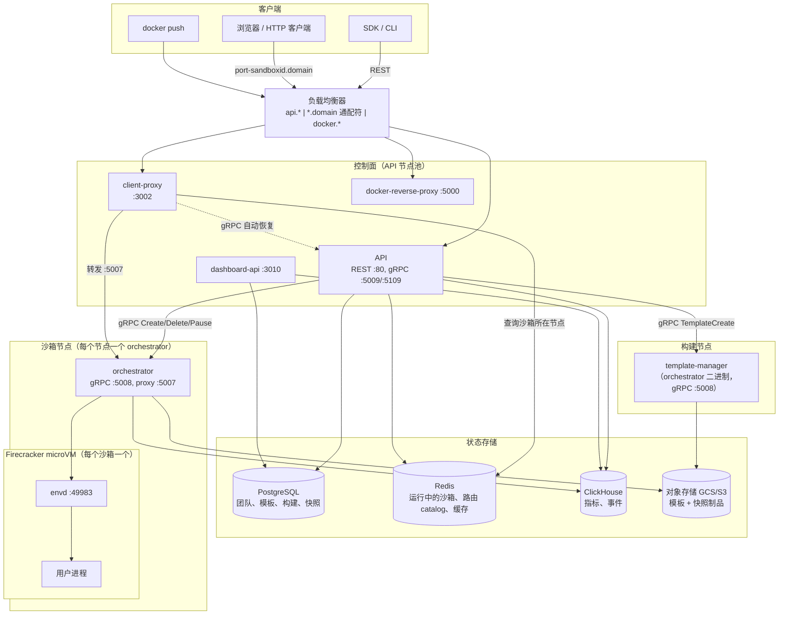
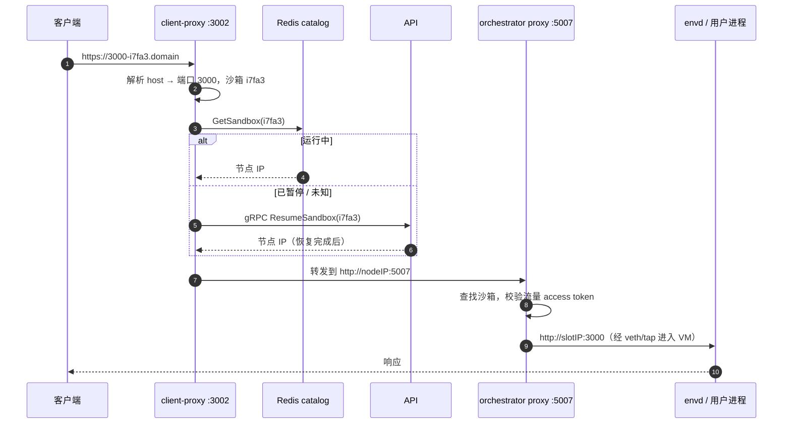
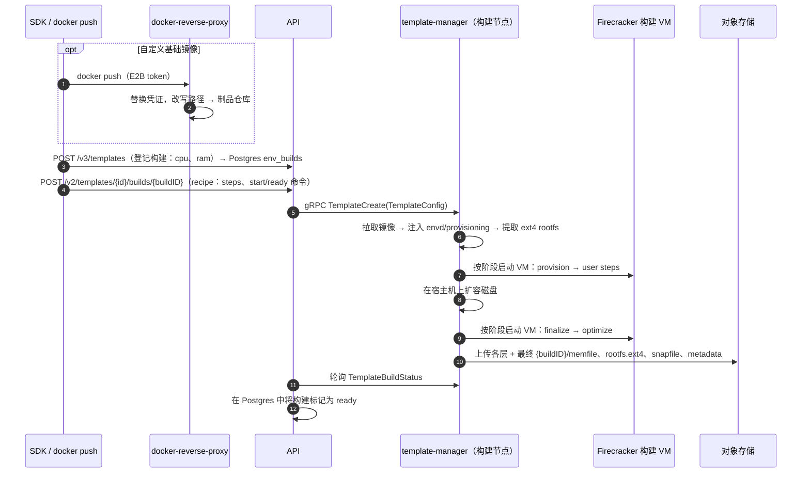
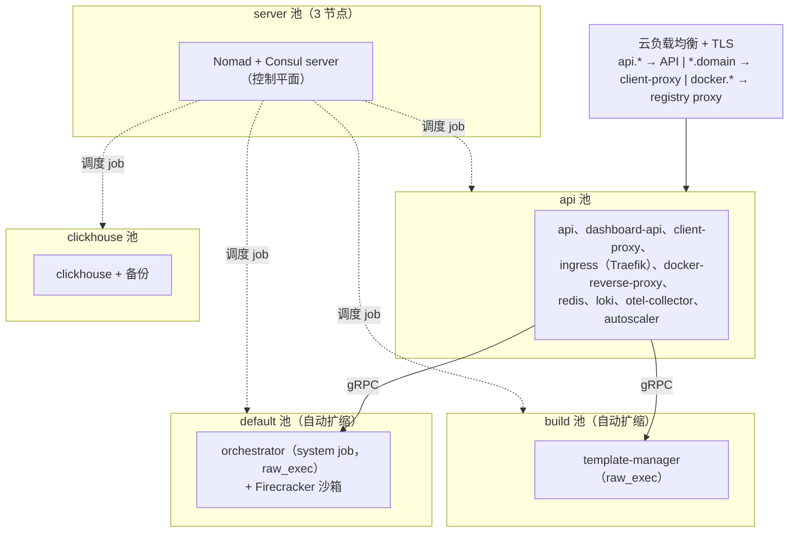

# E2B 基础设施架构总览

> 本文是 [docs/ARCHITECTURE.md](../docs/ARCHITECTURE.md) 的中文翻译，基于提交 `93113e5eb` 翻译于 2026-09-09。以英文原版为准；当代码变更影响原文描述时，请同步更新两份文档。

本文解释这个仓库实现了什么、每个服务的职责是什么、服务之间如何交互。在深入源码之前，它是建立全局心智模型的最快途径。

## 本仓库实现了什么

E2B 提供**沙箱（sandbox）**：几乎可以即时启动的隔离 Linux 虚拟机（它们从预启动的快照恢复，而不是冷启动），可以运行任意代码（通常由 AI agent 生成），并且可以暂停、打快照、恢复。本仓库包含完整的后端：控制面 REST API、基于 **Firecracker microVM** 的数据面 VM 编排、VM 内代理（envd）、边缘路由层、模板构建，以及部署在 GCP（AWS 处于 beta 阶段）上的 Terraform/Nomad 基础设施。

两个驱动设计的核心思想：

1. **沙箱就是一次快照恢复。** 模板是预启动的 VM 快照（内存 + 磁盘 + VM 状态），存储在对象存储中。"创建"沙箱意味着恢复一个快照，这就是启动快的原因。内存页在缺页时惰性加载（userfaultfd），根文件系统是写时复制（COW）overlay，因此只有被触碰的数据才会被读取。
2. **控制面与数据面分离。** API 决定沙箱*在哪里*运行，并记录它*是否*在运行（Postgres/Redis）；每个节点上的 orchestrator 负责*如何*运行（Firecracker、网络、存储）。沙箱流量永远不经过 API。

## 系统总览



## 服务

| 服务 | 包 | 运行位置 | 职责 |
|---|---|---|---|
| API | `packages/api` | API 节点 | 公共 REST API；沙箱生命周期、选点、认证、配额 |
| Orchestrator | `packages/orchestrator` | 每个沙箱节点 | 运行 Firecracker VM；沙箱创建/暂停/恢复/销毁 |
| Template manager | `packages/orchestrator`（角色） | 构建节点 | 从 Docker 镜像构建模板 |
| Client proxy | `packages/client-proxy` | API 节点 | 边缘路由：沙箱 URL → 正确的节点 |
| Envd | `packages/envd` | 每个 VM 内部 | VM 内代理：供 SDK 使用的进程/文件系统 API |
| Dashboard API | `packages/dashboard-api` | API 节点 | Web 控制台后端（团队、构建、管理） |
| Docker reverse proxy | `packages/docker-reverse-proxy` | API 节点 | 用于推送模板镜像的仓库认证网关 |

支撑包：`packages/shared`（proto、遥测、存储客户端、feature flags）、`packages/auth`（认证库）、`packages/db`（Postgres 迁移 + sqlc 查询）、`packages/clickhouse`（ClickHouse schema + 客户端）、`packages/otel-collector`（collector 配置）、`packages/nomad-nodepool-apm`（autoscaler 插件）、`packages/local-dev`（本地栈）。

### API（`packages/api`）

控制面入口（Gin，OpenAPI 从 `spec/openapi.yml` 生成，端口 80）。

- **资源**：沙箱（create/list/kill/pause/resume/connect/timeout/metrics/logs）、模板与构建、团队、卷（volume）、API key/access token、管理操作。
- **认证**（经由 `packages/auth`）：团队 API key（`X-API-Key`，`e2b_` 前缀）、认证提供方 JWT（OIDC）、管理员 token。背后是认证数据库（Postgres）和 Redis 团队缓存。
- **选点（placement）**：维护一份 orchestrator 节点的实时列表（通过 Nomad、Kubernetes 或静态配置发现）。用 **Best-of-K** 算法为每个沙箱选择节点（`internal/orchestrator/placement/`）：随机抽取 K 个就绪节点，按 CPU 承诺量/使用量打分，选最低者；节点资源耗尽时重试。可通过 feature flag 在线调节。
- **状态**：把沙箱记录写入 Redis（*运行中*沙箱的事实来源），以及 client-proxy 读取的沙箱→节点**路由 catalog**。持久实体（模板、构建、快照、团队）存放在 Postgres。
- **额外监听器**：内部 gRPC :5009 和边缘 gRPC :5109 暴露 `ResumeSandbox`，供 client-proxy 在流量到来时唤醒已暂停的沙箱。
- 从 ClickHouse 读取沙箱/团队指标端点；查询 Loki 获取日志；LaunchDarkly feature flag 控制选点参数、限流和灰度发布。

### Orchestrator（`packages/orchestrator`）

一个运行在每个沙箱节点上的 Go 二进制（以 root 身份）。`ORCHESTRATOR_SERVICES` 选择其角色：`orchestrator`（运行沙箱）和/或 `template-manager`（构建模板）。代码在 `pkg/` 下，几乎全部仅限 Linux。

gRPC 服务监听 :5008（`pkg/server/`、`pkg/service/`、`pkg/template/server/`、`pkg/volumes/`）：

- **SandboxService** — `Create`、`Update`、`List`、`Delete`、`Pause`、`Checkpoint`。
- **TemplateService** — `TemplateCreate`、`TemplateBuildStatus`、`TemplateBuildDelete`（仅 template-manager 角色）。
- **InfoService** — 节点身份、角色、容量、健康状态（供 API 节点发现使用）。
- **ChunkService / VolumeService** — 节点间点对点的模板 chunk 服务；持久卷。

关键机制（都在 `pkg/sandbox/` 下）：

- **Firecracker**（`fc/`）：每个沙箱是一个 Firecracker 进程，拥有独立的 cgroup 和网络命名空间。FC HTTP API（unix socket）配置机器、磁盘、网络和快照。guest 元数据（沙箱 ID、envd access token 哈希）通过 MMDS 传入。
- **惰性内存 / UFFD**（`uffd/`）：恢复时 Firecracker 不加载内存直接还原 VM；userfaultfd 处理器直接从模板的 memfile 服务缺页中断，因此只有被触碰的页才会被读取。可选的 prefetcher 会预热已知的热点页。
- **写时复制 rootfs**（`rootfs/`、`nbd/`、`block/`）：模板 rootfs 保持只读；写入进入每沙箱独立的 COW 缓存，以 NBD 块设备的形式暴露给 Firecracker，由进程内的用户态 NBD server 提供服务。暂停时，脏块被导出为 diff。
- **模板缓存**（`template/`）：模板从对象存储惰性拉取并缓存在本地磁盘（可选共享 NFS chunk 缓存，或在 upload 完成前从其他节点点对点获取）。
- **网络**（`network/`）：每个沙箱获得一个 slot——一个包含 veth pair 和 tap 设备的网络命名空间、唯一的主机侧 IP（来自一个 /16）、NAT，以及按 slot 的 nftables 出站防火墙（含检查 SNI/Host 的 TCP 防火墙，用于域名允许/拒绝列表）。slot 池化复用；slot 分配通过 Consul KV 协调。
- **沙箱代理**（:5007，`pkg/proxy/`）：把 client-proxy 进来的流量反向代理到沙箱的 slot IP 和目标端口，并校验每沙箱的流量 access token。
- 把沙箱生命周期**事件**和 cgroup **宿主机统计**写入 ClickHouse；通过 OTel 导出指标。

### Envd（`packages/envd`）

每个 VM 内的代理（由 systemd 在启动很早期拉起），端口 49983，chi + Connect RPC。

- **Process 服务**（`spec/process/process.proto`）：启动/列出/连接进程、流式传输 stdout/stderr、stdin、信号、PTY——这是 SDK "运行代码"的通道。
- **Filesystem 服务**（`spec/filesystem/filesystem.proto`）：stat/list/make/move/remove/watch。
- **REST**：`/health`、`/metrics`、`/files` 上传下载、`/init`（orchestrator 在启动/恢复后推送环境变量、access token、元数据）、暂停期间使用的 freeze/thaw 钩子。
- **认证**：`X-Access-Token` 头与经由 Firecracker MMDS 投递的 token 比对；文件端点使用签名 URL。
- 扫描 guest 端口并转发，用户进程打开的任意端口都能通过沙箱 URL 访问。**每次行为变更必须 bump `pkg/version.go`**——API 和 orchestrator 会按每次模板构建记录的 envd 版本做特性门控。

### Client proxy（`packages/client-proxy`）

所有沙箱流量的无状态边缘（端口 3002；健康检查 3003）。终结 `https://<port>-<sandboxID>.<domain>` 请求（host 解析在 `packages/shared/pkg/proxy/host.go`），在 Redis 路由 catalog 中查找沙箱所在节点，然后反向代理到该节点 orchestrator 的 :5007。如果沙箱不在 catalog 中（已暂停），它调用 API 的 `ResumeSandbox` gRPC 并重试——已暂停的沙箱在流量到来时透明唤醒。

### Dashboard API（`packages/dashboard-api`）

独立的 REST 服务（端口 3010，spec 为 `spec/openapi-dashboard.yml`），由 Web 控制台而非 SDK 消费：团队管理/开通、模板 tag、构建列表、admin 引导。对接 Postgres 和 ClickHouse；从不与 orchestrator 通信。

### Docker reverse proxy（`packages/docker-reverse-proxy`）

Docker Registry v2 认证网关（端口 5000）。用户使用 E2B 凭证 `docker push` 模板基础镜像；代理校验凭证、替换为真实仓库凭证，并把路径改写到云端制品仓库（`/v2/e2b/custom-envs/<templateID>` → 项目 registry）。

## 数据存储

| 存储 | 所属包 | 存放内容 |
|---|---|---|
| **PostgreSQL** | `packages/db`（goose 迁移、sqlc） | 持久控制面状态：`teams`、`users`、`tiers`（配额）、`envs`（模板）、`env_builds`（构建行：vcpu、ram_mb、status、versions）、`env_aliases`、`snapshots`（已暂停沙箱）、`team_api_keys`、`access_tokens`、`volumes`、`clusters` |
| **Redis** | API、client-proxy、orchestrator | 短暂运行时状态：运行中沙箱存储（事实来源）、沙箱→节点路由 catalog、团队/模板/快照缓存、限流、P2P chunk peer 注册 |
| **ClickHouse** | `packages/clickhouse` | 时序/分析：`metrics_gauge`/`metrics_sum`（由 OTel collector 写入）、`sandbox_events`、`sandbox_host_stats`（由 orchestrator 写入）、团队指标。由 API 和 dashboard-api 读取 |
| **对象存储**（GCS/S3/本地，`packages/shared/pkg/storage`） | orchestrator、template-manager | 模板与快照制品，按 build ID 组织：`{buildID}/memfile`、`{buildID}/rootfs.ext4`、`{buildID}/snapfile`、`{buildID}/metadata.json` + `.header` 索引文件 |
| **Consul KV** | orchestrator | 跨重启的网络 slot 分配 |

模板和已暂停沙箱的快照具有**相同的制品形态**——快照就是一个新的 build，其 memfile/rootfs 以相对所属模板的 diff 形式存储（diff 链通过 `.header` 文件解析）。

## 核心流程

### 沙箱创建


API 在 gRPC `Create` 上阻塞，而 gRPC `Create` 又阻塞在 envd 的 `/init` 上——当客户端收到响应时，沙箱已完全可用。全新创建内部其实是模板基础快照的一次*恢复*（只有纯文件系统模板和构建才会真正冷启动）。

### 沙箱流量



### 暂停与恢复

- **暂停**：API 在 Postgres 记录一条快照行，然后向节点发送 gRPC `Pause`。orchestrator 暂停 VM、打快照，将内存（脏页追踪）和 rootfs（COW 缓存）相对模板做 diff，快照先缓存到本地，再异步上传到对象存储（有重试预算）。沙箱从 Redis catalog 中移除。
- **恢复**：与创建同一路径，但选点优先**原节点**——如果快照还在其本地缓存中，恢复可以完全避免读对象存储。`Checkpoint` 是原地暂停+恢复，用于在不中断运行的情况下持久化状态。
- 自动暂停/自动恢复让沙箱事实上 serverless 化：空闲沙箱暂停，流量到来时恢复（见上面的流量流程）。

### 模板构建



构建是**分层的**（`pkg/template/build/phases/`）：base → user → 每个 recipe step 一层 → 扩容磁盘 → finalize → optimize。每层都有哈希并缓存，因此重建只重跑有变化的 step。扩容磁盘在宿主机上对静止的 rootfs 操作；其他未命中缓存的阶段在真实 Firecracker VM 中运行，其暂停 diff 就成为新的层。optimize 阶段记录一次全新恢复会触碰哪些内存页，生成 prefetch 提示，加速后续沙箱启动。

## 部署拓扑

使用 **Terraform**（`iac/provider-gcp/`、`iac/provider-aws/`）部署到 **Nomad + Consul** 集群。Nomad job spec 在 `iac/modules/job-*/jobs/*.hcl`。



- **Server 节点**只运行 Nomad/Consul server（调度、服务发现、Consul DNS——服务之间以 `*.service.consul` 互相寻址）。
- **API 节点**托管所有控制面容器，是负载均衡器唯一的后端。
- **沙箱（"client"）节点**以 Nomad *system* job 经 `raw_exec` 运行 orchestrator（它需要 root 权限来操作 Firecracker、网络命名空间、NBD、cgroups）。配置了 hugepages 和本地模板缓存。自动扩缩。
- **构建节点**以 template-manager 模式运行同一个二进制；`nomad-nodepool-apm` autoscaler 插件随节点池扩缩该 job。
- PostgreSQL 是外部服务（连接串经 secrets 下发）；Redis 作为 Nomad job 或托管服务运行；ClickHouse 运行在独立的节点池上。
- 可观测性：所有服务导出 OTel；collector 分发到 ClickHouse（产品指标）和 Grafana Cloud/stack；日志经 Vector 流入 Loki。

## 仓库布局

```
packages/
  api/                  控制面 REST API
  orchestrator/         沙箱运行时 + 模板构建器（一个二进制，按节点部署）
  client-proxy/         沙箱流量的边缘路由
  envd/                 VM 内代理（行为变更必须 bump pkg/version.go！）
  dashboard-api/        Web 控制台后端
  docker-reverse-proxy/ 模板镜像的仓库认证网关
  shared/               Proto、遥测、存储客户端、proxy 引擎、feature flags
  auth/                 认证库（API key、JWT/OIDC），供 api + dashboard-api 使用
  db/                   Postgres 迁移（goose）+ 查询（sqlc）
  clickhouse/           ClickHouse schema、批量写入器、查询客户端
  otel-collector/       Collector 配置
  nomad-nodepool-apm/   Nomad autoscaler 指标插件与部署感知 target 插件
  local-dev/            docker-compose 本地栈 + DB 种子数据
spec/                   OpenAPI spec（公共、edge、dashboard）——代码生成源
iac/                    Terraform + Nomad job（provider-gcp、provider-aws、共享模块）
tests/integration/      针对真实部署的集成测试
```

跨服务契约全部由生成代码保证：OpenAPI spec 在 `spec/`，gRPC proto 在 `packages/orchestrator/*.proto` 和 `packages/envd/spec/`，SQL 在 `packages/db/queries/`。修改任何一处之后运行 `make generate`。
