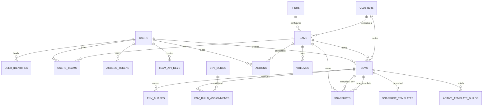

# PostgreSQL 数据库表结构全量分析

> **分析范围**：`packages/db/migrations/` 与 `packages/db/pkg/dashboard/migrations/` 当前迁移链、`packages/db/queries/`、`packages/db/pkg/auth/sql_queries/`、`packages/db/pkg/dashboard/sql_queries/` 的原始 SQL 与 sqlc 生成代码、`packages/db/schema/`、数据库测试及相关业务代码。
>
> **迁移边界**：主迁移由 `packages/db/migrations/` 管理；Dashboard 专属迁移位于 `packages/db/pkg/dashboard/migrations/`，两者不能混为同一迁移目录。
> **校验基线**：本文以仓库中截至 `20260707193000_user_identities_unique_user_issuer.sql` 的迁移文件为准。迁移历史中曾经存在、但当前已删除的列或约束只在“演进与风险”中说明。
>
> **证据等级**：
> - **已确认**：DDL 外键/约束，或 SQL 中明确的 `JOIN`/写入关系。
> - **代码推断**：由触发器、事务、handler 或多处查询共同证明，但数据库没有完整 FK 表达。
> - **命名推测**：只有字段命名或业务语义相似，代码库中未找到足够连接证据。

## 1. 结论摘要

当前 PostgreSQL 业务模型以 `teams` 为租户根，以 `envs` 为模板/快照环境实体，以 `env_builds` 为构建产物，以 `snapshots` 为暂停状态持久化记录。身份、团队成员、凭据、配额、集群和持久卷围绕这条主链路展开。

当前可确认的持久化对象：

| 类型 | 对象 |
|---|---|
| 表（`public`） | `tiers`、`teams`、`users`、`user_identities`、`users_teams`、`team_api_keys`、`access_tokens`、`envs`、`env_aliases`、`env_builds`、`env_build_assignments`、`active_template_builds`、`snapshots`、`snapshot_templates`、`clusters`、`volumes`、`addons`、`env_defaults`（Dashboard 专属迁移） |
| 表（`auth`） | `auth.users` |
| 表（`billing`，迁移链外） | `billing.sandbox_logs` — 结构仅声明在 `packages/db/schema/sqlc_overrides.sql`，供 sqlc 解析；真实 DDL 不在主迁移链中，由外部/独立迁移管理 |
| 视图 | `team_limits`、`active_envs` |
| 未发现的重点表 | 本 PostgreSQL 迁移中没有独立的 usage、event、audit 表；这些状态由 ClickHouse、Redis 及应用/编排层承担。计费加购在 `addons`，sandbox 运行记录在 `billing.sandbox_logs`。 |

## 2. 来源与分析方法

### 2.1 数据库定义来源

- 初始表和基础关系：`packages/db/migrations/20231124185944_create_schemas_and_tables.sql`
- 构建拆分：`packages/db/migrations/20240315165236_create_env_builds.sql`
- 快照：`packages/db/migrations/20241213142106_create_snapshots.sql`
- 凭据 hash 化：`packages/db/migrations/20250211160814_add_token_hashes.sql`、`20250910124212_remove_raw_keys.sql`
- 集群：`packages/db/migrations/20250606213446_deployment_cluster.sql`
- 多对多 build assignment：`packages/db/migrations/20251218160000_allow_builds_with_tags.sql`
- snapshot template：`packages/db/migrations/20260211120000_add_snapshot_templates.sql`
- 软删除 env：`packages/db/migrations/20260628120000_add_env_deleted_at.sql`
- OIDC identity 唯一性：`packages/db/migrations/20260515120000_create_user_identities_table.sql`、`20260707193000_user_identities_unique_user_issuer.sql`

完整迁移演进仍应以 `packages/db/migrations/` 为准；本文不把历史上已删除的列当作当前 schema。

### 2.2 查询、生成代码与测试来源

- sqlc 配置：`packages/db/sqlc.yaml`
- 生成模型：`packages/db/queries/models.go`
- 生成查询实现：`packages/db/queries/**/*.sql.go`
- 原始查询按 `builds/`、`snapshots/`、`templates/`、`template_aliases/`、`teams/`、`volumes/` 等目录组织。
- 测试根目录：`packages/db/pkg/tests/`，覆盖 builds、snapshots、template aliases、templates、identity、volumes；通用数据库 fixture 在 `packages/db/pkg/testutils/tests.sql`。
- Dashboard 专属迁移：`packages/db/pkg/dashboard/migrations/20260316130000_dashboard_add_env_defaults_and_team_profile_picture.sql`，创建 `env_defaults`（`env_id → envs.id`）并向 `teams` 增加 `profile_picture_url`。Dashboard 查询源位于 `packages/db/pkg/dashboard/sql_queries/`，生成代码位于 `packages/db/pkg/dashboard/queries/`。
- Auth 查询源位于 `packages/db/pkg/auth/sql_queries/`，生成代码位于 `packages/db/pkg/auth/queries/`。
- Core 查询源位于 `packages/db/queries/`，生成代码与查询源共置。

## 3. 模块与表总览

| 模块 | 表/视图 | 主要职责 |
|---|---|---|
| 身份认证 | `auth.users`、`users`、`user_identities` | 外部身份源、业务用户投影、OIDC 多身份绑定 |
| 租户与权限 | `tiers`、`teams`、`users_teams` | 团队租户、订阅配额、成员和默认团队 |
| 凭据 | `team_api_keys`、`access_tokens` | 团队级 API key、用户级 access token |
| 模板与构建 | `envs`、`env_aliases`、`env_builds`、`env_build_assignments`、`active_template_builds` | 模板实体、别名、构建产物、tag 关联和并发计数 |
| Sandbox 与快照 | `snapshots`、`snapshot_templates` | sandbox 暂停状态及可复用快照模板 |
| 基础设施与存储 | `clusters`、`volumes` | orchestrator 集群、团队持久化卷 |
| 计费与配额 | `addons`、`team_limits` | tier 基础配额、时间有效的额外配额及聚合结果 |
| 软删除读模型 | `active_envs` | 过滤 `envs.deleted_at` 后的规范读入口 |

## 4. 分模块表说明

### 4.1 身份认证模块

#### `auth.users`

- **功能/场景**：Supabase 风格的外部身份源；保存 `id`、`email`、创建时间和 metadata。业务表历史上曾引用它，但当前迁移已把业务 FK 指向 `public.users`。
- **主键/约束/索引**：`id` 为 uuid 主键；当前未发现业务表的有效 FK 依赖。
- **生命周期**：由认证系统管理，不由 E2B 业务 API 直接维护。
- **读写位置**：`packages/db/migrations/20000101000000_auth.sql` 及历史触发器；当前用户 provisioning 逻辑在应用层。
- **关系**：`auth.users.id → public.users.id` 仅是历史/业务对应关系，当前属于**代码推断**，不是现存 FK。

#### `public.users`

- **功能/场景**：E2B 业务用户投影，作为团队成员、token、创建者和 identity 的统一用户主键。
- **字段**：`id uuid`、`created_at timestamptz`、`updated_at timestamptz`；旧 `email` 已在迁移中删除。
- **主键/约束/索引**：`id` 主键；时间戳由默认值/更新时间逻辑维护。
- **生命周期**：注册/provisioning 时创建；删除会影响多个业务 FK，创建者字段通常 `SET NULL`。
- **关系**：被 `user_identities.user_id`、`users_teams.user_id/added_by`、`access_tokens.user_id`、`team_api_keys.created_by`、`envs.created_by`、`addons.added_by` 引用，均为**已确认**，但删除动作依字段不同为 `CASCADE`、`SET NULL` 或 `NO ACTION`。

#### `user_identities`

- **功能/场景**：同一业务用户绑定多个 OIDC issuer/subject。
- **字段**：`oidc_iss text`、`oidc_sub text`、`user_id uuid`、`created_at`、`updated_at`。
- **主键/约束/索引**：复合主键 `(``oidc_iss``, ``oidc_sub``)`；唯一索引 `(user_id, oidc_iss)`；`user_id → users.id ON DELETE CASCADE`。
- **生命周期/入口**：OIDC 登录 provisioning 时 upsert；`packages/db/pkg/tests/user_identities_test.go` 验证唯一性和绑定行为。
- **关系**：`user_identities.user_id → public.users.id` 为**已确认**，issuer 与外部 IdP 的关系是**代码推断**。

#### `billing.sandbox_logs`（迁移链外）

- **功能/场景**：sandbox 运行记录（启停时间、规格、磁盘），供按 team+sandbox 查询历史记录。`GetSandboxRecordByTeamAndSandboxID`（`queries/sandboxes/get_sandbox_record.sql`）以它为主表，LEFT JOIN `teams`、`clusters`、`snapshots`、`env_aliases`。
- **字段/约束**：`sandbox_id`、`env_id`、`vcpu`、`ram_mb`、`total_disk_size_mb`、`started_at`、`stopped_at`、`created_at`、`team_id`。上述结构来自 `schema/sqlc_overrides.sql`，仅用于 sqlc 代码生成，**不代表真实数据库 DDL**；主键、索引和 FK 未知。
- **迁移边界**：不在 `packages/db/migrations/` 中创建，真实 DDL 由外部管理（**待确认**归属：另一服务迁移或手工运维）。
- **关系**：`team_id → teams.id` 为 SQL LEFT JOIN 表达的**代码推断**（无 FK 证据）；`env_id` 与 `envs.id` 语义对应但查询中从未直接 JOIN（通过 `snapshots.base_env_id` COALESCE 兜底），属于**命名推测**。

#### `env_defaults`（Dashboard 专属表）

- **功能/场景**：Dashboard 为环境/模板提供的默认描述配置；每个 `env_id` 至多一条。
- **字段/约束**：`env_id text` 同时为主键和 `public.envs(id)` 外键；`description text` 可空。
- **来源/生命周期**：`packages/db/pkg/dashboard/migrations/20260316130000_dashboard_add_env_defaults_and_team_profile_picture.sql`；随对应 env 的数据库级级联行为取决于该迁移中 FK 的默认删除策略，当前迁移未显式声明 `ON DELETE`，需要人工确认实际清理路径。
- **主要读写位置**：Dashboard 模块专属 sqlc 查询/生成代码；主 Core 查询目录没有该表的查询。
- **关系等级**：`env_defaults.env_id → envs.id` 为**已确认**；Dashboard 与 Core env/template 展示语义为**代码推断**。

#### `teams.profile_picture_url`（Dashboard 扩展字段）

- 不是独立表，而是 Dashboard 专属迁移向 `teams` 添加的可空文本字段。
- 用于 Dashboard 团队资料展示；是否被所有 API 读写路径共享，需要结合 Dashboard 查询和业务 handler 继续确认。

#### `tiers`

- **功能/场景**：团队订阅层级和基础配额字典。当前字段包括 `id`、`name`、`disk_mb`、`concurrent_instances`、`max_length_hours`、`max_vcpu`、`max_ram_mb`、`concurrent_template_builds`、`events_ttl_days`。
- **主键/约束/索引**：`id text` 主键；多个资源值有正数 CHECK；无运行时外键入表以外的业务关系。
- **生命周期/入口**：迁移/seed 管理，运行时主要读取；通过 `teams.tier` 被团队引用。
- **关系**：`teams.tier → tiers.id` 为**已确认**；与 `team_limits` 的聚合为**已确认**。

#### `teams`

- **功能/场景**：多租户根实体，模板、构建、快照、卷、密钥和配额都以 `team_id` 隔离。
- **字段**：`id`、`created_at`、`name`、`email`、`slug`、`tier`、`is_banned`、`is_blocked`、`blocked_reason`、`cluster_id`、`sandbox_scheduling_labels`、`sso_organization_id`、`sso_auto_join`。
- **主键/约束/索引**：`id uuid` 主键；`slug` 唯一；`tier → tiers.id`；`cluster_id → clusters.id` 可空；SSO organization 有非空 partial index 但允许多个 team。
- **生命周期/入口**：注册/provisioning 创建，管理员更新封禁和 SSO 配置；`packages/db/queries/teams/resolve_team.sql` 按用户成员关系解析 slug。
- **关系**：`teams` 是多个表的父表，具体关系见第 5 节；`sso_organization_id` 与外部身份系统是**代码推断**而非 FK。

#### `users_teams`

- **功能/场景**：用户与团队的多对多成员关系，带 `is_default`、`added_by` 和 `created_at`。
- **字段/约束**：当前同时保留历史 `id bigint` 和新的 `uuid_id uuid` 主键语义；`user_id`、`team_id`、`added_by`、默认团队字段及创建时间。
- **唯一性**：`(team_id, user_id)` 唯一；`(user_id) WHERE is_default = true` partial unique，保证每个用户最多一个默认 team。
- **生命周期/入口**：邀请、自动加入、移除成员；`packages/db/queries/teams/team_members.sql` 和 `packages/db/pkg/tests/db_test.go` 等覆盖。
- **关系**：`user_id/added_by → users.id`、`team_id → teams.id` 为**已确认**；用户→团队的权限含义由 API 授权代码**代码推断**，本表不存角色列。

### 4.3 凭据模块

#### `team_api_keys`

- **功能/场景**：团队级 API key。真实 key 不再持久化，服务端按 hash 校验。
- **字段**：`id`、`api_key_hash`、`api_key_prefix`、`api_key_length`、`api_key_mask_prefix`、`api_key_mask_suffix`、`team_id`、`created_at`、`updated_at`、`name`、`last_used`、`created_by`。
- **约束/索引**：`id` 主键；`api_key_hash` 唯一；`team_id → teams.id ON DELETE CASCADE`；`created_by → users.id ON DELETE SET NULL`；团队和 hash 均有查询索引。
- **生命周期/入口**：创建时返回一次明文 key，鉴权成功后更新 `last_used`，删除时按 `id` 清理；主要业务入口为 API auth/key handler。
- **关系**：所属 team 和创建用户均为**已确认**；key 与请求中的 Bearer token 的验证链为**代码推断**。

#### `access_tokens`

- **功能/场景**：用户级 access token，与 team API key 并存。
- **字段**：`id`、`access_token_hash`、prefix/length/mask 字段、`user_id`、`created_at`、`name`。
- **约束/索引**：hash 唯一；`user_id → users.id ON DELETE CASCADE`；按 user 和 hash 建索引；明文 `access_token` 已删除。
- **生命周期/入口**：用户创建、鉴权和撤销；查询/生成代码在 `packages/db/pkg/auth/` 及 `packages/db/queries/`。
- **关系**：`user_id → users.id` 为**已确认**，token 与具体 team 的关系仅通过用户成员资格形成，为**代码推断**。

### 4.4 Template 与 Build 模块

#### `envs`

- **功能/场景**：模板、snapshot env 和 snapshot template 的统一实体；`source` 区分来源，`deleted_at` 提供软删除。
- **字段**：`id text`、时间戳、`public`、`build_count`、`spawn_count`、`last_spawned_at`、`team_id`、`created_by`、`cluster_id`、`source`、`deleted_at`。
- **约束/索引**：`id` 主键；`team_id → teams.id`；`created_by → users.id SET NULL`；`cluster_id → clusters.id` 可空；团队/source、时间游标和模板 partial 索引。
- **生命周期/入口**：模板创建/更新时 upsert；删除采用 `deleted_at`，同时释放 alias 和活跃 build；`queries/templates/*.sql`、`get_team_templates*.sql` 和模板 handler 是主要入口。
- **关系**：team、creator、cluster 为**已确认**；与 build 的完整关系通过 assignment 表实现；`envs` 是核心被引用表。

#### `env_aliases`

- **功能/场景**：模板可读别名，支持 `namespace` 区分团队私有和公共别名。
- **字段/约束**：`id uuid`、`alias`、`is_renamable`、`env_id`、`namespace`；`env_id → envs.id ON DELETE CASCADE`；`(alias, namespace)` 唯一且 NULL 使用 `NULLS NOT DISTINCT`。
- **生命周期/入口**：模板构建/发布时创建或 upsert，env 软删除时释放；`queries/template_aliases/*.sql`、alias cache 和相关测试覆盖。
- **关系**：`env_aliases.env_id → envs.id` 为**已确认**；namespace 与 `teams.slug` 的对应是**代码推断**，数据库没有 team FK。

#### `env_builds`

- **功能/场景**：每一次 template/snapshot 构建的配置、硬件规格、状态、版本和节点信息。
- **字段**：`id`、时间戳、`status`、`status_group`、Docker/start/ready 命令、`vcpu`、`ram_mb`、磁盘、kernel/Firecracker/envd 版本、`env_id`、`team_id`、`reason`、CPU 信息、`cluster_node_id`。
- **约束/索引**：`id` 主键；状态/status_group、team+时间游标、team+env、活跃部分索引和 covering index；当前 `env_id`、`team_id`、`cluster_node_id` 可空且前两者没有 FK。
- **生命周期/入口**：waiting/pending/building/in_progress/ready/success 或失败状态；API 创建，template-manager/orchestrator 更新；`packages/db/queries/builds/*.sql` 与 builds 测试覆盖。
- **关系**：完整 env/build 关系是**代码推断**：由 `env_build_assignments` 和触发器回填冗余 `env_id/team_id`；不能把 `env_builds.env_id` 当作唯一父 FK。

#### `env_build_assignments`

- **功能/场景**：`envs` 与 `env_builds` 的多对多关联，额外携带 `tag`、`source` 和时间。
- **约束/索引**：`id` 主键；`env_id → envs.id CASCADE`；`build_id → env_builds.id CASCADE`；按 env/tag/time、build 建索引；历史/trigger 数据有 partial unique。
- **生命周期/入口**：每次 build 发布、tag 更新或 snapshot template 复用时写入；按最新 `created_at` 解析 tag；模板、构建和 snapshot 测试覆盖。
- **关系**：两条 FK 为**已确认**；同一 `(env, tag)` 多行取最新是**已确认的 SQL 业务语义**，不是唯一约束。

#### `active_template_builds`

- **功能/场景**：轻量活跃构建计数表，用于 `tiers.concurrent_template_builds` 配额检查。
- **字段/约束**：`build_id` 主键、`team_id`、`template_id`、`tags`、`created_at`；`template_id → envs.id CASCADE`；按 team/time 和 template 建索引。
- **生命周期/入口**：构建进入进行中时插入，成功/失败或模板删除时删除；`packages/db/queries/builds/active_template_builds.sql` 和对应测试覆盖。
- **关系**：`template_id → envs.id` 为**已确认**；`build_id → env_builds.id` 是业务上明显但数据库未声明 FK，属于**代码推断**，可能留下孤立计数行。

### 4.5 Sandbox 与 Snapshot 模块

#### `snapshots`

- **功能/场景**：sandbox pause/auto-pause 后保存可恢复状态、元数据、网络和节点配置。
- **字段**：`id`、`created_at`、`env_id`、`base_env_id`、`sandbox_id`、启动时间、`metadata`、`env_secure`、`origin_node_id`、网络策略、`auto_pause`、`team_id`、`config`。
- **约束/索引**：`id` 主键；`sandbox_id` 唯一；`env_id/base_env_id → envs.id CASCADE`；`team_id → teams.id`；团队时间游标、env、base env 和 metadata GIN 索引。
- **生命周期/入口**：按 sandbox upsert，resume 读取最近快照，kill/清理时联动；`packages/db/queries/snapshots/*.sql`、snapshot 测试和 orchestrator pause 流程覆盖。
- **关系**：三条 FK 为**已确认**；`env_id` 是快照自身 env、`base_env_id` 是原模板的区别由 SQL 和业务流程**代码推断**。

#### `snapshot_templates`

- **功能/场景**：把某个 snapshot env 提升为可反复 spawn 的模板。
- **字段/约束**：`env_id`（同时 PK/FK）、`sandbox_id`、`created_at`、`origin_node_id`、`build_id`；`env_id → envs.id CASCADE`；sandbox_id 有普通索引。
- **生命周期/入口**：checkpoint 创建，模板删除时随 env 清理；`list_team_snapshot_templates.sql` 和 snapshot 测试覆盖。
- **关系**：env 一对一扩展关系为**已确认**；`build_id → env_builds.id` 当前无 FK，属于**代码推断**。

### 4.6 基础设施、存储与配额模块

#### `clusters`

- **功能/场景**：orchestrator 集群注册、endpoint、TLS、代理域名、OIDC organization 和显示名。
- **约束/索引**：`id` 主键；`auth_org_id` 非空 partial unique；`teams.cluster_id`、`envs.cluster_id` 可选引用。
- **生命周期/入口**：迁移/运维配置管理；API 启动通过 `get_active_clusters.sql` 加载被 team 使用的集群。
- **关系**：team/env 到 cluster 为**已确认**；路由优先级“env cluster → team cluster → 默认集群”是**代码推断**。

#### `volumes`

- **功能/场景**：团队级 NFS/persistent 卷，sandbox 启动时按团队和名称解析挂载。
- **字段/约束**：`id`、`team_id`、`name`、`volume_type`、`created_at`；`team_id → teams.id`；`(team_id, name)` 唯一。
- **生命周期/入口**：CRUD 在 `packages/db/queries/volumes/volumes.sql` 和 API volumes handler；挂载配置引用 `name`。
- **关系**：team FK 为**已确认**；sandbox 与 volume 的挂载关系只保存在 snapshot `config`/应用请求中，未发现中间表，属于**代码推断**。

#### `addons`

- **功能/场景**：团队在 tier 之外购买的时效性资源加成，含并发 sandbox/build、CPU、内存、磁盘和事件保留天数。
- **字段/约束**：`id`、`team_id`、名称描述、各 `extra_*`、`valid_from/to`、`added_by`、`idempotency_key`；team FK `CASCADE`，added_by FK `NO ACTION`；幂等 key 有非空 partial unique。
- **生命周期/入口**：billing webhook/管理员创建，过期记录保留作审计；由 `team_limits` 按有效时间聚合。
- **关系**：team、added_by 及视图聚合为**已确认**；Stripe/payment provider 的外部订单关系在本库没有字段，属于**待确认**。

#### `team_limits`（视图）

- **功能/场景**：将 `teams`、`tiers` 和当前有效 `addons` 聚合为最终配额。
- **核心字段**：team id、最大运行时长、并发 sandbox/build、最大 vCPU/RAM、磁盘和事件 TTL。
- **来源/读路径**：由 addons 迁移创建/更新，API team context 读取；不是独立存储表。
- **关系**：视图到三张源表为**已确认**；视图结果不是账单事实，只是授权/配额计算结果。

#### `active_envs`（视图）

- **功能/场景**：`envs WHERE deleted_at IS NULL` 的软删除过滤读模型。
- **读路径**：模板、构建、snapshot 查询大量 JOIN 该视图；写路径仍直接操作 `envs`。
- **关系**：与 `envs` 是一对一过滤投影，属于**已确认**；任何直接读取 `envs` 的代码是否遗漏软删除过滤，需要人工审查。

## 5. 表关系清单

| 左表.字段 | 右表.字段 | 关系类型 | 关系依据 | 可信度 |
|---|---|---|---|---|
| `teams.tier` | `tiers.id` | 多对一 | DDL FK | 高 |
| `users_teams.user_id` | `users.id` | 多对一 | DDL FK | 高 |
| `users_teams.team_id` | `teams.id` | 多对一 | DDL FK | 高 |
| `users_teams.added_by` | `users.id` | 多对一，可空 | DDL FK/SET NULL | 高 |
| `user_identities.user_id` | `users.id` | 多对一 | DDL FK/identity tests | 高 |
| `team_api_keys.team_id` | `teams.id` | 多对一 | DDL FK | 高 |
| `team_api_keys.created_by` | `users.id` | 多对一，可空 | DDL FK | 高 |
| `access_tokens.user_id` | `users.id` | 多对一 | DDL FK | 高 |
| `envs.team_id` | `teams.id` | 多对一 | DDL FK | 高 |
| `envs.created_by` | `users.id` | 多对一，可空 | DDL FK | 高 |
| `envs.cluster_id` | `clusters.id` | 多对一，可空 | DDL FK | 高 |
| `env_aliases.env_id` | `envs.id` | 多对一 | DDL FK/CASCADE | 高 |
| `env_build_assignments.env_id` | `envs.id` | 多对一 | DDL FK/JOIN | 高 |
| `env_build_assignments.build_id` | `env_builds.id` | 多对一 | DDL FK/JOIN | 高 |
| `active_template_builds.template_id` | `envs.id` | 多对一 | DDL FK/CASCADE | 高 |
| `snapshots.env_id` | `envs.id` | 多对一 | DDL FK/JOIN | 高 |
| `snapshots.base_env_id` | `envs.id` | 多对一 | DDL FK/业务 SQL | 高 |
| `snapshots.team_id` | `teams.id` | 多对一 | DDL FK | 高 |
| `snapshot_templates.env_id` | `envs.id` | 一对一扩展 | PK 同时 FK | 高 |
| `billing.sandbox_logs.team_id` | `teams.id` | 多对一 | `get_sandbox_record.sql` LEFT JOIN；无 FK | 中 |
| `billing.sandbox_logs.env_id` | `envs.id` | 逻辑映射 | 字段命名；查询走 `snapshots.base_env_id` COALESCE | 低/待确认 |
| `env_defaults.env_id` | `envs.id` | 一对一扩展 | Dashboard 迁移中的 PK + FK | 高 |
| `teams.cluster_id` | `clusters.id` | 多对一，可空 | DDL FK/active cluster query | 高 |
| `volumes.team_id` | `teams.id` | 多对一 | DDL FK/volumes.sql | 高 |
| `addons.team_id` | `teams.id` | 多对一 | DDL FK/team_limits view | 高 |
| `addons.added_by` | `users.id` | 多对一 | DDL FK | 高 |
| `env_builds.env_id` | `envs.id` | 多对一（冗余首个关联） | assignment AFTER INSERT trigger 回填；无 FK | 中 |
| `env_builds.team_id` | `teams.id` | 多对一（冗余归属） | assignment trigger 回填；无 FK | 中 |
| `snapshot_templates.build_id` | `env_builds.id` | 多对一 | 查询/业务写入；无 FK | 中 |
| `active_template_builds.build_id` | `env_builds.id` | 多对一 | 配额清理 SQL；无 FK | 中 |
| `env_aliases.namespace` | `teams.slug` | 逻辑映射 | alias 解析/命名约定；无 FK | 中 |
| `auth.users.id` | `public.users.id` | 一对一历史投影 | 历史触发器/身份 provisioning；现无 FK | 中 |
| `users.id` | 外部 OIDC subject | 一对多外部映射 | `user_identities.oidc_iss/oidc_sub` | 中 |
| `snapshots.config` | `volumes` | 逻辑挂载 | JSON 配置与 volume 查询；无 FK | 低/待确认 |

## 6. Mermaid 核心 ER 图

## 7. 典型业务流程与字段链路

### 7.1 注册、OIDC 登录与团队上下文

1. 外部身份进入 `auth.users` 或 OIDC provider。
2. 应用 provisioning 创建/查找 `users`，并 upsert `user_identities`。
3. 创建或选择 `teams`，通过 `users_teams.user_id/team_id` 建成员关系。
4. `teams.tier` 关联 `tiers`，再通过 `team_limits` 得到配额。
5. API 使用 `team_id` 作为后续模板、build、snapshot、volume 和 key 的隔离条件。

事务/一致性重点：`(user_id, oidc_iss)`、默认团队 partial unique 和 `(team_id,user_id)` 唯一约束应共同防止并发 provisioning 重复数据。

### 7.2 创建模板与构建

`users/team → envs.id → env_builds.id → env_build_assignments(env_id, build_id, tag) → active_template_builds`。

- `envs` 保存模板身份和可见性；
- `env_builds` 保存规格、Dockerfile、状态和产物信息；
- assignment 支持一个 build 被多个 env/tag 复用；
- active 表只保存进行中的 build，用于并发配额；
- `active_envs` 避免软删除模板被读取。

### 7.3 启动、暂停与恢复 Sandbox

1. 按 `team_id` 和模板 id/alias 找到 `active_envs`。
2. 通过 `env_build_assignments` + `env_builds.status_group='ready'` 选可用 build。
3. pause/upsert 以 `sandbox_id` 唯一定位 `snapshots`。
4. snapshot 的 `env_id` 表示自身 snapshot env，`base_env_id` 表示原模板。
5. resume 读取 snapshot `config`，其中可能包含 volume mount、网络和 auto-resume 配置。

### 7.4 快照提升为模板

`snapshots.sandbox_id → new envs(source='snapshot_template') → snapshot_templates.env_id → env_build_assignments/build_id`。

`build_id` 和 JSON 配置的数据库 FK 不完整，应用事务和测试是主要一致性保障。

### 7.5 API Key、配额与计费

- API key：`team_api_keys.team_id`；用户级 token：`access_tokens.user_id`。
- 计费扩展：`addons.team_id` + `valid_from/valid_to`；幂等键防止 webhook 重放。
- 最终限额：`tiers` 基础值 + 当前有效 `addons`，由 `team_limits` 输出。
- sandbox 运行记录（启停时间、规格）在 `billing.sandbox_logs`，但该表 DDL 不在主迁移链中管理。
- 未发现 PostgreSQL invoice/payment/customer 表；Stripe 或其他账单事实应在外部系统，**待人工确认**。

## 8. 风险、缺失约束与待确认项

### 8.1 已确认的模型风险

1. `env_builds.env_id`、`env_builds.team_id` 是无 FK 的反范式字段，若 assignment 触发器、重试或手工 SQL 失败，可能与真实 assignment 不一致。
2. `active_template_builds.build_id` 无 FK，删除 build 后可能留下 zombie quota row；代码通过完成/失败清理缓解，应增加后台校验或约束设计评估。
3. `snapshot_templates.build_id` 无 FK，存在已删除 build 仍被引用的可能。
4. `snapshots.config` 中的 volume 名称没有 FK，卷重命名/删除只能由应用层协调。
5. `env_build_assignments` 对 `source='app'` 的 `(env_id, build_id, tag)` 不做全量唯一限制，查询必须按时间取最新；重复写入是允许的业务语义，但需要确保所有读取都遵循排序。
6. `envs` 使用软删除，而多个查询/业务代码仍可能直接访问基础表；直接查询必须确认是否有意读取“已删除但仍保留”的行。

### 8.2 可能缺少审计/计费实体

- 没有独立 `audit_events`、`team_usage`、`invoices`、`payments`、`sandbox_instances` 表。
- 日志/事件主要位于 ClickHouse 或其他服务；PostgreSQL 的 `last_used`、`created_at`、`added_by` 只能提供有限审计能力。
- 这不是确定缺陷：架构文档显示 ClickHouse/Redis/对象存储分别承担分析、运行态和制品职责；是否需要 PostgreSQL 审计表需要产品与合规要求确认。

### 8.3 命名不一致与历史包袱

- `envs` 同时表示模板、snapshot env 和 snapshot template，真实语义依赖 `source`。
- `env_builds.env_id` 与 assignment 的完整多对多关系语义不一致；它只代表首个关联/冗余值。
- `users_teams` 同时保留历史 `id bigint` 和当前 `uuid_id`，新代码需确认使用哪一个。
- `teams.is_blocked` 与 `is_banned` 并存，语义和兼容路径需要继续梳理。
- `public.users` 与 `auth.users` 都有用户 id，但当前不是数据库 FK；名称相同容易误判为直接引用。
- `team_api_keys`、`access_tokens` 的 hash/mask 字段是当前凭据模型，旧明文列已删除，文档或工具不得按旧列查询。

### 8.4 孤立表/字段判定

当前没有足够证据把任何现存表判定为完全孤立。`clusters`、`addons`、`active_template_builds` 虽然运行时写入较少，但分别被集群发现、配额视图和 build 查询使用。

建议人工确认：

1. `snapshot_templates.build_id` 是否应补 FK，或明确允许历史 build 清理；
2. `active_template_builds.build_id` 是否应增加 FK/定期 orphan cleanup；
3. `env_builds.team_id` 是否允许跨团队 assignment，还是应由业务约束保证一致；
4. volume 是否需要独立的 sandbox-to-volume 关联表；
5. billing provider 的 customer/invoice/entitlement 是否在外部数据库；
6. `auth.users` 与 `public.users` 的同步边界及删除语义；
7. `users_teams.id` 的兼容用途何时可以移除；
8. 是否需要保留不可变 audit/event 表满足合规审计。

## 9. 查询与测试索引

### 9.1 迁移跟踪与 Dashboard 边界

- Goose 使用 `_migrations` 作为迁移跟踪表，配置见 `packages/db/client/migration.go`；它不是业务表。
- `packages/db/pkg/dashboard/migrations/` 的迁移不应仅凭 Core `packages/db/migrations/` 的扫描结果判断是否已部署。
- Dashboard 的 `env_defaults` 和 `teams.profile_picture_url` 是当前数据库分析中容易遗漏的专属对象。

| 主题 | 原始 SQL/测试 |
|---|---|
| 团队解析与成员 | `packages/db/queries/teams/resolve_team.sql`、`team_members.sql` |
| 模板列表/删除/别名 | `packages/db/queries/templates/*.sql`、`template_aliases/*.sql`、`pkg/tests/templates/*`、`pkg/tests/template_aliases/*` |
| Build 状态与并发 | `packages/db/queries/builds/*.sql`、`pkg/tests/builds/*` |
| Snapshot | `packages/db/queries/snapshots/*.sql`、`pkg/tests/snapshots/*` |
| Volume | `packages/db/queries/volumes/volumes.sql`、`pkg/tests/volumes/db_test.go` |
| sqlc 模型 | `packages/db/queries/models.go`、`packages/db/queries/db.go` |
| Auth 查询 | `packages/db/pkg/auth/sql_queries/`（access_token、api_keys、teams、user_identities、users、users_teams） |
| Dashboard 查询 | `packages/db/pkg/dashboard/sql_queries/`（teams、templates） |

**测试覆盖空白**（按目录结构判断，未做覆盖率统计）：auth 的 22 个查询与 dashboard 的全部查询没有对应专项测试;`tiers`/`team_limits` 配额合并、`teams`/`clusters` 删除行为、`envs` 软删除过滤、`addons` 聚合、`billing.sandbox_logs` 均无直接数据库测试。阅读这些路径时应以迁移和 SQL 为准，而非测试行为。

> **维护建议**：新增迁移时同步更新本文的“表总览、字段/约束、关系清单、ER 图和风险项”；新增 SQL 或测试时更新第 9 节。字段的最终类型和 nullable 状态以迁移及 sqlc 生成结果为准，不以本文摘要取代 schema。
