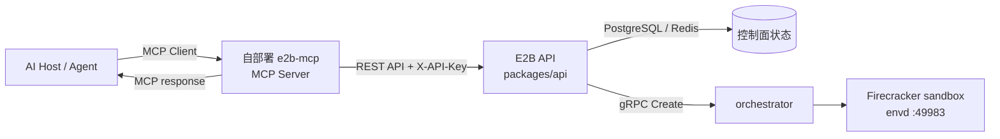
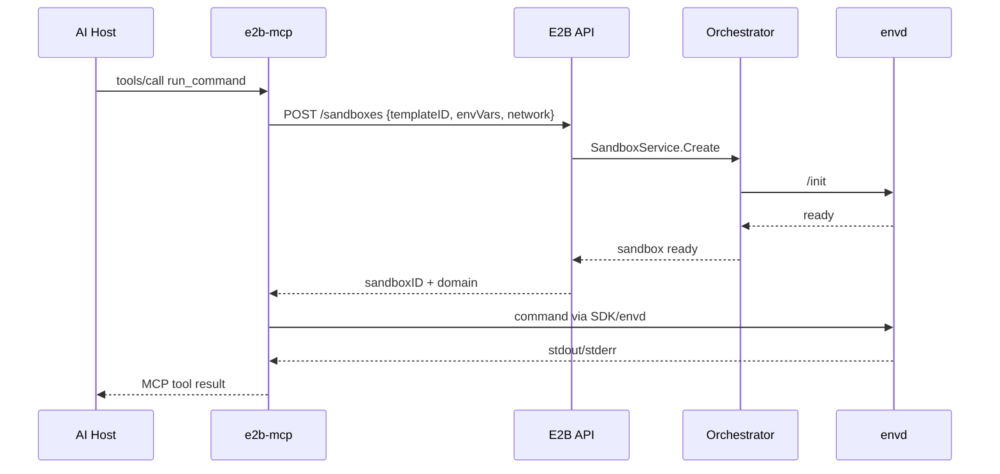
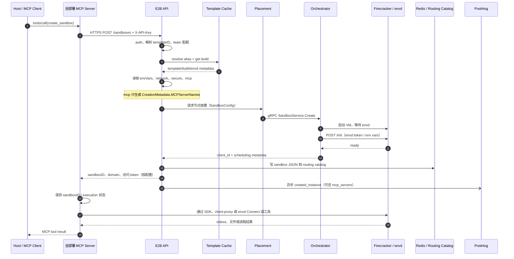

# MCP 与自部署 E2B 服务

本文解释两个容易混淆的概念：Model Context Protocol(MCP)本身，以及本仓库对
sandbox 创建请求中 mcp 字段的支持。最后把它们和“自己部署一个调用 E2B 的 MCP
服务”放在同一张架构图里。

> 结论先行：当前仓库不是 MCP Server，也没有实现 MCP 的 JSON-RPC、stdio、SSE 或
> Streamable HTTP transport。仓库里的 mcp 只是 sandbox 创建请求中的扩展 JSON；API
> 当前只记录它的顶层名称用于创建事件分析，不会启动 MCP Server，也不会把配置传给
> orchestrator。

## 1. 三个角色要分开

MCP 的基本参与者如下：

| 角色 | 责任 | 在自部署 E2B 方案中的对应物 |
| --- | --- | --- |
| Host | 承载 AI 应用，决定何时调用工具 | IDE、Agent、内部自动化平台 |
| MCP Client | 与一个 MCP Server 建立会话，发现 tools/resources/prompts | Host 内的 MCP SDK |
| MCP Server | 暴露工具协议，并把工具调用转换成实际业务操作 | 你自己部署的 e2b-mcp 服务 |

E2B 基础设施处在 MCP 之外：它负责创建 sandbox、放置到节点、启动 Firecracker VM，
并通过 envd 提供进程和文件操作。一个自部署 MCP Server 可以把这些 E2B 能力包装成
create_sandbox、run_command、read_file 等 MCP tools，但这层包装代码不在本仓库
里。



这张图里的 MCP 链路和 sandbox 数据面链路是两条不同的链路：工具调用先到 MCP
Server，MCP Server 再调用 E2B API；用户程序产生的 HTTP 流量则由 client-proxy
直接转发到 sandbox 所在节点，不会经过 Dashboard API 或 MCP Server。

## 2. 当前仓库到底支持什么

### 2.1 OpenAPI 中的 mcp 字段

spec/openapi.yml 定义了一个 Mcp 对象：

```yaml
Mcp:
  type: object
  description: MCP configuration for the sandbox
  additionalProperties: {}
  nullable: true
```

它被 NewSandbox 的 mcp 属性引用，因此创建 sandbox 时可以发送任意 JSON 对象。
生成的 Go 类型是 map[string]interface{}，这意味着 API 不校验具体的 server 名称、
URL、transport 或 credentials 结构。

### 2.2 Create 请求中的实际处理

packages/api/internal/handlers/sandbox_create.go 当前做的事情是：

1. 解析 body.Mcp，但不读取其中的 value。
2. 将整个 map 作为参数传给 startSandbox。
3. packages/api/internal/handlers/sandbox.go 的 buildCreationMetadata 只提取
   maps.Keys(mcp)，保存为 MCPServerNames。
4. packages/api/internal/orchestrator/analytics.go 在 created_instance 事件中把
   这些名称写入 mcp_servers 属性。

mcp 不会进入 SandboxMetadata，也不会进入 packages/orchestrator/orchestrator.proto
中的 SandboxConfig。因此它不会改变 VM 启动、envd 初始化、网络规则或进程环境。

| 位置 | 能观察到的 MCP 信息 | 不会发生的事情 |
| --- | --- | --- |
| API create handler | 收到一个可选的 JSON map | 不解析 server 配置 |
| 创建元数据 | 顶层 key 列表，如 filesystem、browser | 不保存 value |
| PostHog created_instance | mcp_servers: ["filesystem", ...] | 不执行 MCP tool |
| orchestrator gRPC | 没有 MCP 字段 | 不启动 MCP 进程、不注入 MCP 环境变量 |

### 2.3 生命周期边界

mcp 是创建请求的观测信息，不是 sandbox 的持久化配置。暂停后由流量自动恢复、显式
resume、connect 或 fork 的路径会以 nil MCP 元数据启动，因此恢复事件不会自动重新
带上原始 mcp_servers 列表。需要持续关联时，应使用 sandbox metadata、外部数据库或
MCP Server 自己的会话存储，而不是依赖该字段。

## 3. 自己部署 e2b-mcp 的推荐拓扑

### 3.1 MCP Server 放在 E2B 控制面之外

这是最容易隔离权限和升级的方式。e2b-mcp 是一个普通的业务服务，负责：

- 实现 MCP transport 和 JSON-RPC 生命周期；
- 校验 Host 传入的 tool 参数；
- 用服务端保存的 E2B API key 调用 POST /sandboxes、/pause、/resume 等 API；
- 通过 E2B SDK、envd Connect RPC 或 sandbox URL 完成实际操作；
- 把结果转换为 MCP 的 content 响应。

典型的工具调用顺序如下：



控制面 API 的 API key 只应存在于 e2b-mcp 的服务端 secret 中。MCP Client 不需要、也
不应该直接拿到该 key。若 e2b-mcp 运行在另一个集群，至少要允许它访问 API 的域名和
端口；sandbox 的出网规则是另一层策略，不会因为 MCP Server 能访问 API 而自动放行。

### 3.2 将 MCP Server 进程放进 sandbox

也可以把 MCP Server 作为模板中的应用进程：

1. 构建一个包含 MCP Server 二进制和配置的 template。
2. MCP Server 通过 envd 启动或由模板内的 init/systemd 启动。
3. MCP Server 监听 sandbox 内端口。
4. Host 通过 sandbox domain 访问该端口，或让外部代理把该端口转换为 MCP transport。

这种方式适合每个 sandbox 都需要一套隔离的工具依赖，但运维成本更高：每次 template
build 都可能改变 MCP Server 版本，进程日志要从 sandbox 日志链路收集，且必须处理
sandbox timeout、pause、resume 和端口重新发现。

如果入口关闭了公网访问，创建请求必须启用 secure，由 API 生成 envd access token；
外部 MCP 客户端还需要使用 sandbox traffic access token。不要把 envd token 或 traffic
token 放进公开的 MCP tool 响应。

## 4. mcp 字段应该怎么用

下面的请求是语法上可接受的示例：

```json
{
  "templateID": "team-slug/python-env:latest",
  "timeout": 900,
  "envVars": {
    "WORKSPACE": "/home/user"
  },
  "mcp": {
    "filesystem": {
      "transport": "streamable-http",
      "url": "https://mcp.example.internal/filesystem"
    }
  }
}
```

但在当前实现中，E2B API 只会把 filesystem 这个 key 记录到创建事件。transport、
url 和其他 value 不会被 API 使用；这段 JSON 不会让 sandbox 自动连接到该 MCP
Server，也不会让 sandbox 内出现名为 filesystem 的进程。

因此有两种清晰用法：

- **观测标签**：把实际使用的 MCP Server 名称作为 key，方便分析创建行为；不要把
  secret、完整 token 或高基数用户数据塞进 value。
- **业务配置**：由自部署 e2b-mcp 保存和解释。若 sandbox 内的程序也要读到配置，
  使用明确的 envVars、模板文件或启动参数，不要假设 mcp 会自动注入。

若需要在恢复后继续使用同一组 MCP Server，MCP Server 应以 sandboxID 为 key 保存
会话和配置，并在每次 resume 后重新发现 sandbox 状态。mcp 字段本身不承担这个
持久化职责。

## 5. 网络、鉴权和生命周期

### 5.1 两条网络路径

| 路径 | 目的 | 主要控制点 |
| --- | --- | --- |
| e2b-mcp → E2B API | 创建、暂停、恢复和查询 sandbox | API key、API auth middleware、服务间 TLS/防火墙 |
| Host/MCP Client → sandbox URL | 访问 sandbox 内 MCP Server 或用户服务 | client-proxy、sandbox domain、traffic token、Ingress 配置 |
| sandbox → 外部 MCP Server | 让 VM 内程序调用远端 MCP 工具 | network.egress、allow/deny domain、egress proxy |

不要把第一条路径的 API key 当作第三条路径的出网许可。allowInternetAccess=false
或 network.egress.denyOut 仍然会阻断 sandbox 的外连；需要访问外部 MCP Server 时，
应显式允许其域名，并把 DNS 解析所需的 nameserver 一并考虑进去。

### 5.2 Pause / Resume 的影响

- 完整内存 snapshot 可以保留 MCP Server 的进程内状态，但恢复仍然可能落到不同节点，
  外部连接必须可重建。
- filesystem-only snapshot 会冷启动，不能由流量自动恢复；MCP Server 必须重新启动。
- e2b-mcp 不应只在本地内存保存 sandbox 映射。至少保存 sandboxID、template/build
  版本、最后状态和重连策略。
- 对长连接 transport，resume 后重新建立 MCP session；不要假设 TCP 连接会跨 snapshot
  保持。

### 5.3 多团队部署

API 会在请求进入时按 team 鉴权，template 可见性和 sandbox 并发配额也按 team 生效。
自部署 e2b-mcp 应把 MCP 用户映射到 team/API key，而不是让所有用户共用一个无审计
的全局 key。工具层还要限制可用 template、允许的 egress 域名和命令参数。

## 6. 常见误解

### “传了 mcp，E2B 就会启动 MCP Server”

不会。当前代码只提取 map 的 key 做 analytics。MCP Server 必须由你自己的服务、模板
进程或其他部署单元启动。

### “mcp.url 会自动注入到 VM”

不会。需要注入到 VM 时使用 envVars、模板文件或显式的 envd 命令；这些配置的安全性
和生命周期由你的应用负责。

### “MCP Server 可以直接访问 orchestrator gRPC”

不建议，也不是公开边界。控制面 API 才负责 placement、配额和 Redis routing catalog；
MCP Server 应调用 API 或受支持的 SDK，而不是绕过 API 连接节点 gRPC。

### “sandbox URL 就等于 MCP endpoint”

不等于。sandbox URL 只是 client-proxy 到 sandbox 端口的路由。只有当端口上确实运行
符合 MCP transport 的服务时，它才是 MCP endpoint。

## 7. 代码阅读路线

想继续追踪这条关系时，可以按下面顺序阅读：

1. spec/openapi.yml 的 Mcp schema 和 NewSandbox.mcp 引用：确认 API 契约的宽松结构。
2. packages/api/internal/handlers/sandbox_create.go：观察 body.Mcp 在 create 请求中的
   读取时机。
3. packages/api/internal/handlers/sandbox.go：阅读 buildCreationMetadata，确认只提取
   server names。
4. packages/api/internal/orchestrator/analytics.go：查看 mcp_servers 如何进入
   created_instance analytics event。
5. packages/api/internal/orchestrator/create_instance.go 和
   packages/orchestrator/orchestrator.proto：确认 MCP 没有进入 SandboxConfig/gRPC。
6. packages/client-proxy 与 packages/envd：理解外部请求如何到达 sandbox 端口，以及
   MCP Server 进程如何被启动和访问。

把 MCP 协议实现放在自部署服务，把 sandbox 生命周期交给 E2B API，把数据面访问交给
client-proxy/envd，是这个仓库当前边界下最清楚、也最容易审计的分层方式。

## 8. 从 `POST /sandboxes` 到 MCP tool result 的真实调用链

下面的链路把 MCP Server、E2B 控制面和 sandbox 数据面拆开。图中的 `mcp` 只在 API
创建处理的旁路中出现；它不会随 gRPC 请求进入 orchestrator，也不会改变 Firecracker
配置。



### 8.1 API 创建阶段的顺序

当前实现的关键顺序如下：

1. `PostSandboxes` 先完成 team 鉴权、模板 alias 解析、build 读取和请求字段校验。
   `mcp` 与 `envVars`、`metadata`、`network` 在同一处从请求体读取，但只有后面三者
   会影响 sandbox 数据或控制配置。参见
   [`sandbox_create.go`](../packages/api/internal/handlers/sandbox_create.go)。
2. 创建 handler 调用 `startSandbox`，并把 `mcp` 作为创建元数据参数继续传递。参见
   [`sandbox.go`](../packages/api/internal/handlers/sandbox.go)。
3. `buildCreationMetadata` 使用 `maps.Keys(mcp)` 生成名称列表，不读取 map value；随后
   `CreateSandbox` 用 `SandboxData` 组装真正的 `SandboxConfig`。
4. `create_instance.go` 在 public ingress 关闭时生成 traffic token，把 network 转换成
   orchestrator 结构，生成 placement 请求，并通过 `SandboxService.Create` 发往节点。
   这个请求没有 MCP 字段。参见
   [`create_instance.go`](../packages/api/internal/orchestrator/create_instance.go) 和
   [`orchestrator.proto`](../packages/orchestrator/orchestrator.proto)。
5. 节点启动 Firecracker 后，orchestrator 通过 envd `/init` 设置 token、环境变量和恢复
   所需状态。`/init` 的 token 校验使用现有 token 或 Firecracker MMDS 中的 hash；它不是
   MCP 握手。

### 8.2 创建成功后的三个旁路

创建成功并不表示 MCP tool 已经可以执行。至少要分别验证：

- **控制面响应**：API 返回 sandbox 标识和 domain；MCP Server 应保存这些值，并根据
  自己的工具协议决定后续调用哪个端口。
- **路由可用**：sandbox 写入 Redis 后，routing callback 同步更新节点目录，避免请求
  在目录尚未更新时被转发。目录只记录节点和生命周期信息，不记录 `mcp`。
- **观测事件**：`Store.Add` 在 Redis 写入和 routing callback 完成后异步触发创建回调；
  PostHog 的 `created_instance` 事件可以包含 `mcp_servers` 名称列表。该事件失败不会
  回滚已经运行的 sandbox。

`mcp_servers` 因而只能回答“创建请求声明了哪些名称”，不能回答“哪个 MCP tool 已启动”、
“调用是否成功”或“sandbox 内是否监听了对应端口”。要记录这些事实，应由 MCP Server
  自己产生低基数、去密钥化的业务指标。

## 9. 字段生命周期与持久化边界

下表描述的是当前代码路径，不是未来 MCP 配置中心的设计。`未写入` 表示该字段不会
作为对应存储对象的结构化字段保存；如果字段最终进入 guest 文件系统、进程环境或快照
内存，那属于另一个数据边界。

| 字段 | 首次处理点 | Redis sandbox JSON | orchestrator / guest | 事件或其他存储 | resume 行为 | 风险与说明 |
| --- | --- | --- | --- | --- | --- | --- |
| `mcp` | API handler → `CreationMetadata` | 未写入 | 未进入 `SandboxConfig` | PostHog `created_instance.mcp_servers` 只含顶层 key；ClickHouse `InstanceStarted` 无 MCP 字段 | resume/connect/fork 传 `nil`，不会自动复用名称 | value 可包含任意 JSON，不能放 secret、完整 URL token 或用户隐私 |
| `envVars` | API handler → `SandboxData` | `Sandbox` 结构没有该字段 | 进入 `SandboxConfig.EnvVars`，由 envd `/init` 应用 | 可能随 guest 文件、进程环境或快照间接存在；不是 MCP analytics 字段 | 由 snapshot / resume 数据重新应用，取决于恢复类型 | 环境变量可能包含凭据；不要把它当作公开 tool 参数回显 |
| `metadata` | API handler → `SandboxData` | `Sandbox.Metadata` 保存 | 进入 `SandboxConfig.Metadata` | 不是 `mcp_servers`；不会自动写 PostHog | 按 sandbox/snapshot 数据恢复 | 适合低敏关联标识；不要放 token 或高基数日志内容 |
| `secure` / envd token | create handler 生成 `EnvdAccessToken` | 保存于 `EnvdAccessToken`，并由 API 模型返回 | 传入 `SandboxConfig.EnvdAccessToken`，envd 用 `X-Access-Token` 校验 | 不应写入 PostHog、ClickHouse 或普通日志；snapshot 可能保留 guest 状态 | memory resume 保留；cold boot 通过 MMDS handshake 和 `/init` 重新设置 | 这是 envd 边界的 secret，不等于 API key 或 traffic token |
| traffic token | orchestrator 在 public ingress 关闭时生成 | 保存于 `TrafficAccessToken`，并由 API 模型返回 | 写入 `SandboxNetworkConfig.Ingress` | 不应出现在 analytics；routing catalog 不保存 token | resume 重新带入 proxy / ingress 配置 | 非 envd 端口请求使用 `e2b-traffic-access-token` header |
| `network` | handler 校验 allow/deny/rules，再由 API 转换 | `Sandbox.Network` 保存 | 进入 `SandboxConfig.Network`；egress proxy 凭据也随配置传递 | 不应把代理密码写日志或 PostHog；对象存储只可能间接保存快照 | 恢复时使用 snapshot/config 中的网络边界 | egress 规则影响 sandbox 出网，不会让 `mcp` 自动连接远端服务 |
| `autoPause` / `autoResume` | handler 生成策略 | `Sandbox.AutoPause` / `AutoResume` 保存 | 进入 `SandboxConfig`，由 orchestrator 执行 | 事件可记录策略摘要；没有 MCP 关联 | full-memory 可按策略自动恢复；filesystem-only 不能被任意流量自动恢复 | 长连接 MCP session 必须自行重连 |
| team / placement | auth、cluster 和 placement | team、node、execution 等保存 | 进入 gRPC config 和节点运行时 | routing catalog 保存节点 IP、execution ID、时间边界 | resume 会优先尝试快照原节点，再按 placement 规则选择节点 | 不能让 MCP Server 绕过 team 配额直接访问节点 gRPC |

### 9.1 Redis、对象存储和分析系统的边界

- **Redis sandbox store**：序列化的是
  [`sandboxtypes.Sandbox`](../packages/api/internal/sandbox/sandboxtypes/sandbox.go)，
  包括 sandbox ID、team、build、network、生命周期、token 等运行态字段；没有 `mcp`
  或 `MCPServerNames`。Redis 还维护 team 索引和 expiration ZSET。
- **Routing catalog**：由生命周期 callback 同步写入，主要用于 client-proxy 查找
  orchestrator 节点和执行状态。它不是 MCP 注册表，也不是 secret vault。
- **对象存储 / snapshot**：pause、checkpoint 和 build 流程可能写入 rootfs、memfile
  及其元数据。`mcp` 不会被作为 snapshot 字段写入；guest 内实际生成的文件、环境变量
  或进程内状态则可能随快照类型保存。
- **ClickHouse**：`InstanceStarted` 事件记录 sandbox 资源和启动事实，没有 mcp 字段。
  不要通过查询 ClickHouse 推断 MCP tool 调用成功。
- **PostHog**：只有创建回调在 `mcp` 非空时设置 `mcp_servers`。回调是异步的，名称列表
  可能因部署版本、请求重试或恢复路径而缺失；它不提供可靠的配置存储语义。

### 9.2 访问 token 的特殊处理

当前 API 的 `ToAPISandbox` 会把 `EnvdAccessToken` 和 `TrafficAccessToken` 映射到 API
响应模型。对于自部署 MCP Server，这意味着：

1. token 只能在服务端内存的最短路径中使用，使用后从结构化日志、异常、trace 属性和
   MCP tool result 中删除。
2. 服务端持久化时应使用受控 secret store 或加密字段，不要把整个 API 响应原样写入会话
   数据库。
3. 发送给 Host 的结果只返回完成业务操作所需的最小信息；Host 不需要知道 envd token
   或 traffic token 的生成方式。

这些限制是部署建议，不代表当前仓库已经替 MCP Server 完成脱敏。

## 10. 鉴权与 secret 处理

### 10.1 三层凭据不是同一个东西

| 凭据 | 使用方 | 传输位置 | 保护边界 |
| --- | --- | --- | --- |
| E2B API key | MCP Server → API | HTTPS `X-API-Key`（旧 bearer access token 仅按 API 兼容配置使用） | 只放 MCP Server 后端 secret；不下发给 Host 或 sandbox |
| traffic access token | Host/MCP Server → 非 envd sandbox 端口 | `e2b-traffic-access-token` | 由 client-proxy/orchestrator proxy 校验；public ingress 开启时可能不生成 |
| envd access token | MCP Server → envd API | `X-Access-Token` | 由 secure sandbox 的 envd middleware 校验；envd 端口不依赖 traffic token |
| signed file access | 文件客户端 → envd files | 签名 query 参数或 `X-Access-Token` | 仅适用于支持 signing 的 filesystem 操作，不能替代 API key |

`secure=true` 只表示为 envd 生成 access token；它不会自动让 MCP Server 拥有 API 权限，
也不会自动把 sandbox 的所有端口设为私有。反过来，关闭 public ingress 时，API 会要求
同时启用 secure envd access，并为非 envd 端口生成 traffic token。

### 10.2 envd `/init` 的 handshake

envd 在 secure 模式下通过 `WithAuthorization` 检查 `X-Access-Token`，但 `POST /init`
属于 auth-excluded 路径，由专门的 token 验证处理。`/init` 接受以下情况：

- token 与 envd 当前 token 相同；
- token 与 orchestrator 写入 Firecracker MMDS 的 hash 匹配；
- 首次初始化时没有旧 token 且 MMDS 没有旧 hash。

验证成功后 `/init` 可以更新环境变量、access token、默认用户、工作目录和 volume mount，
并 thaw 因 pause 被冻结的 cgroup。这个过程是 E2B 内部初始化协议，不能被描述为 MCP
`initialize` 请求，也不会读取创建请求中的 `mcp` value。详见
[`auth.go`](../packages/envd/internal/api/auth.go) 和
[`init.go`](../packages/envd/internal/api/init.go)。

### 10.3 日志和 telemetry 的最低要求

在 MCP Server 和基础设施两侧都应遵循以下规则：

- API key、envd token、traffic token、egress proxy password 不写入 `mcp` value、
  `metadata`、PostHog properties、ClickHouse event 或普通日志。
- 记录 sandboxID、teamID、executionID 和 trace ID，而不是记录完整请求体；需要调试时
  只保留 `mcp` 顶层 key 的 allowlisted 名称。
- 对 Host 返回的错误做分层映射：把 API 的认证/配额错误和 sandbox 内工具的业务错误分开，
  不把内部 token、节点 IP 或 Redis key 暴露给模型。
- 用 secret manager 注入 MCP Server 的 API key；不要把 key 烘焙进 template、Docker
  镜像或 sandbox 环境变量，除非这是明确的、短时的下游凭据。

## 11. Network / transport 选择

### 11.1 MCP transport 与 E2B transport 的关系

本仓库没有实现 MCP transport。自部署 MCP Server 可以按 Host 能力选择 stdio、SSE 或
Streamable HTTP；选择不会改变 E2B 控制面协议。典型的内部链路是：

| 链路 | 当前实现 | 作用 |
| --- | --- | --- |
| Host ↔ MCP Server | 由 MCP Server 自己选择 stdio/SSE/Streamable HTTP | MCP JSON-RPC session、tool discovery 和 result |
| MCP Server ↔ E2B API | HTTPS REST | team 鉴权、模板解析、sandbox 生命周期 |
| API ↔ orchestrator | internal gRPC `SandboxService` | placement、Create/Update/Pause 等控制操作 |
| client-proxy ↔ 节点 | HTTP 到 orchestrator proxy `:5007` | 根据 Redis catalog 把外部请求送到节点 |
| orchestrator proxy ↔ sandbox | HTTP 到 sandbox slot port | 校验 traffic token 后转发到 guest 端口 |
| MCP Server ↔ envd | HTTP 或 Connect RPC | process/filesystem 操作；默认 envd HTTP 端口为 `49983` |

envd 的 Process 和 Filesystem Connect 定义位于
[`packages/envd/spec/process/process.proto`](../packages/envd/spec/process/process.proto) 和
[`packages/envd/spec/filesystem/filesystem.proto`](../packages/envd/spec/filesystem/filesystem.proto)。
它们是 E2B 数据面 API，不是 MCP tool schema。

### 11.2 端口暴露和 host 路由

`sandbox domain` 只表示 client-proxy 可以解析出 sandbox 和端口；它不会创建监听器，
也不会把 `mcp.url` 变成 endpoint。要让 Host 调用 sandbox 内 MCP Server，必须同时满足：

1. template 或 envd 启动了真正实现 MCP transport 的进程；
2. 进程监听了约定端口并在 pause/resume 后重新监听；
3. 网络 ingress 和 traffic/envd token 策略允许请求到达该端口；
4. MCP Server 知道 sandboxID、domain、端口和恢复后的新路由信息。

client-proxy 查询不到 Redis catalog 时可以尝试 gRPC auto-resume；恢复成功后再把请求
转到节点的 `:5007`。节点上的 orchestrator proxy 还会重试 sandbox envd 的端口转发延迟，
而 client-proxy 不会重复这一组重试。相关实现见
[`proxy.go`](../packages/client-proxy/internal/proxy/proxy.go) 和
[`orchestrator/pkg/proxy/proxy.go`](../packages/orchestrator/pkg/proxy/proxy.go)。

### 11.3 sandbox egress 的实际语义

`network.allowOut`、`denyOut`、domain rules 和 egress proxy 只控制 sandbox 发往外部的
流量。它们不会：

- 注册远端 MCP Server；
- 为 Host 打开 sandbox ingress；
- 注入 `mcp` 中的 URL；
- 替代 MCP Server 的 DNS、TLS 或应用层鉴权。

当 allow list 含域名时，API 会要求阻断其他流量，并在转换为 orchestrator 网络配置时
补充默认 nameserver，保证域名规则可解析。egress proxy 的地址、用户名和密码会作为
network 配置向节点传递，部署时应将其视为 secret 配置处理。

## 12. 错误、重试与暂停恢复边界

### 12.1 创建请求的错误分类

MCP Server 应把错误按层分类，而不是对所有非 2xx 都无限重试：

| 阶段 | 常见结果 | 是否可直接重试 |
| --- | --- | --- |
| 请求解析 / schema | 400，包含无效 template、network 或互斥 auto-pause 参数 | 否；先修正 tool 参数 |
| API auth / team / template 可见性 | 401/403/404 | 否；切换凭据或模板后再试 |
| build/template cache | 404、服务端错误或构建不可用 | 只有明确为临时依赖故障时重试 |
| placement / 节点资源 | 500 或资源耗尽 | 可退避重试，但要确认上一次是否已创建 |
| Redis store / routing callback | sandbox 已启动但 API 返回失败 | 不要盲目再次 create；先查询 sandbox 状态并等待清理 |
| sandbox 内 MCP tool | 端口、envd、进程或业务错误 | 按工具幂等性和 transport 状态重试 |

`Store.Add` 在写 Redis 失败时会触发节点清理；但网络超时可能发生在客户端收到响应
之前。MCP Server 应持久化请求幂等键（或自己的 operation ID）、sandboxID 和 execution
状态，以便在不确定时查询而不是创建第二个 sandbox。

### 12.2 竞争和重复请求

orchestrator 使用 reservation/join 逻辑保护并发启动；已有 reservation 时，等待者可以
读取已存在的 sandbox。这个行为不能替代 MCP Server 的幂等策略，因为不同请求仍可能拥有
不同的 template、timeout 或网络配置。建议：

- `create_sandbox` 的 tool 参数包含业务幂等键，服务端按 team + key 保存最终 sandboxID；
- 同一个 key 在状态为 creating 时返回可轮询的 operation，而不是重复调用 API；
- resume/connect 失败时保留原 sandboxID，避免把恢复失败误报为新建失败；
- 只有收到明确的 NotFound 且 snapshot/TTL 也已确认不存在时，才允许开始新的 create。

### 12.3 client-proxy auto-resume 的结果映射

client-proxy 查不到 routing catalog 时会调用 API gRPC resume。源码将结果区分为：

- `PermissionDenied`：sandbox 属于其他 team 或恢复未授权，应返回不可重试的权限错误；
- `NotFound`：没有可恢复快照，回退为 sandbox route not found；
- `FailedPrecondition` 且状态为 transitioning：返回“仍在转换中”，短暂退避后再试；
- `ResourceExhausted`：节点或 team 资源不足，按配额窗口退避；
- 其他错误：保留原始 transport/服务错误，但不要把节点内部地址暴露给 Host。

MCP Server 不应再实现一套与 client-proxy 相同的端口转发重试；它只需处理上述最终
错误和 MCP session 重连。

### 12.4 full-memory 与 filesystem-only

完整内存 snapshot 可以保留 MCP Server 进程的内存状态，但不能保证外部 TCP 连接、负载
均衡连接或 Host 端 session 在恢复后仍有效。filesystem-only snapshot 会丢失进程、socket
和 guest page cache，恢复时必须 cold boot，并重新执行 envd `/init`；该类型不能由任意
流量自动 resume，只能显式 resume/connect。

因此 MCP Server 应把连接状态视为可丢失资源：

1. 将 sandboxID、template/build、端口、最后已知状态和 session 恢复信息保存到外部存储；
2. 每次 tool call 先确认 sandbox 状态，必要时调用受支持的 resume/connect API；
3. 对长连接 transport 在恢复后重新建立 MCP session，并重新做 capability discovery；
4. 对仍在执行的命令设置超时和取消语义，不把 snapshot 恢复当作进程继续运行的保证。

## 13. 部署拓扑与排障

### 13.1 两种部署边界

| 方案 | 优点 | 需要额外承担的工作 |
| --- | --- | --- |
| 外置 MCP Server | API key、MCP session 和升级节奏独立于 sandbox；适合共享工具服务 | 需要保存 sandbox 映射、处理跨节点路由、为 Host 提供稳定 transport |
| MCP Server 放进 template | 每个 sandbox 隔离依赖和权限，工具可与代码同机 | template build 管理、进程启动、端口暴露、snapshot 恢复和日志采集 |

外置方案通常更容易审计。template-in-sandbox 方案只有在工具必须与用户文件和进程共处
时才值得采用，并且不应依赖 `mcp` 字段来启动进程。

### 13.2 最小 smoke checklist（建议方案）

部署新 MCP Server 或模板版本时，按以下顺序验证：

1. 用最低权限 API key 创建一个短 TTL sandbox，确认 template、team 和 network 校验
   通过。
2. 若使用 secure envd，确认 MCP Server 能安全传递 `X-Access-Token`，并能访问
   `/health` 与需要鉴权的 process/filesystem endpoint。
3. 若关闭 public ingress，确认非 envd 端口请求带有正确的
   `e2b-traffic-access-token`，错误 token 被拒绝。
4. 在 sandbox 内启动实际 MCP Server，直接从其监听端口完成一次 initialize、tools/list
   和 tools/call；不要只验证 `mcp` 字段被接受。
5. 观察 Redis sandbox 和 routing catalog，再从 client-proxy 发起一次请求，确认请求
   到达正确节点和端口。
6. 触发 full-memory pause/resume；再次建立 MCP session。另行测试 filesystem-only
   的显式 connect/resume，确认服务进程重新启动。
7. 检查 PostHog 只出现低敏的 `mcp_servers` 名称，不出现 value、API key 或 token；检查
   envd、orchestrator proxy 和 MCP Server 日志无 secret 泄漏。

### 13.3 症状到层的定位

| 症状 | 首先检查 | 可能结论 |
| --- | --- | --- |
| create 返回 400，mcp 内容复杂但没有报错 | OpenAPI 与 handler | `mcp` value 未校验；真正错误通常来自 template/network/auto-pause 字段 |
| PostHog 没有 `mcp_servers` | `buildCreationMetadata`、异步 creation callback | 请求可能没有 mcp key，或恢复路径显式传 `nil`；不代表 MCP tool 失败 |
| API 成功但端口连接拒绝 | template 进程、监听端口、envd `/health` | 没有实际 MCP Server，或进程在 cold boot 后未重启 |
| 非 envd 端口返回 missing/invalid traffic token | client-proxy 和节点 proxy header | ingress 被设为私有；应使用 `e2b-traffic-access-token`，不是 envd token |
| envd 返回 401 | `X-Access-Token`、secure 配置、`/init` 日志 | envd token 不匹配或初始化失败；不要改用 API key |
| catalog miss 后得到 transitioning | client-proxy resume gRPC 状态 | sandbox 正在 pause/resume；退避并重试同一请求，不要 create 新实例 |
| filesystem-only resume 后状态丢失 | snapshot metadata、reboot、MCP 进程启动 | 这是预期的 cold boot 边界；重新发现工具和工作目录 |
| sandbox 出网到 MCP Server 失败 | network allow/deny、nameserver、egress proxy | egress 策略阻断；`mcp.url` 本身不会放行网络 |

建议的证据顺序是：API trace → Redis sandbox/routing → 节点 proxy → envd health/metrics
与日志 → sandbox 内 MCP Server 日志 → PostHog/ClickHouse 事件。先确认数据面是否存在，
再解释 analytics 标签，避免把观测缺失误判成运行失败。

## 14. 代码索引与证据分级

### 14.1 关键源码索引

| 主题 | 入口 |
| --- | --- |
| `mcp` schema、请求模型 | [`spec/openapi.yml`](../spec/openapi.yml) |
| create handler、secure/network 校验 | [`sandbox_create.go`](../packages/api/internal/handlers/sandbox_create.go) |
| creation metadata、resume 传 nil | [`sandbox.go`](../packages/api/internal/handlers/sandbox.go)、[`sandbox_resume.go`](../packages/api/internal/handlers/sandbox_resume.go)、[`sandbox_connect.go`](../packages/api/internal/handlers/sandbox_connect.go) |
| SandboxData → gRPC、traffic token、network 转换 | [`create_instance.go`](../packages/api/internal/orchestrator/create_instance.go) |
| Redis sandbox 模型和 API 映射 | [`sandboxtypes/sandbox.go`](../packages/api/internal/sandbox/sandboxtypes/sandbox.go)、[`storage/redis/operations.go`](../packages/api/internal/sandbox/storage/redis/operations.go) |
| routing callback 和异步 analytics | [`store.go`](../packages/api/internal/sandbox/store.go)、[`analytics.go`](../packages/api/internal/orchestrator/analytics.go)、[`lifecycle.go`](../packages/api/internal/orchestrator/lifecycle.go) |
| orchestrator 请求边界 | [`orchestrator.proto`](../packages/orchestrator/orchestrator.proto) |
| client-proxy catalog miss / auto-resume | [`proxy.go`](../packages/client-proxy/internal/proxy/proxy.go)、[`paused_sandbox_resumer_grpc.go`](../packages/client-proxy/internal/proxy/paused_sandbox_resumer_grpc.go) |
| 节点端 traffic token 和端口转发 | [`orchestrator/pkg/proxy/proxy.go`](../packages/orchestrator/pkg/proxy/proxy.go) |
| envd HTTP、Connect、token handshake | [`envd/main.go`](../packages/envd/main.go)、[`envd/internal/api/auth.go`](../packages/envd/internal/api/auth.go)、[`envd/internal/api/init.go`](../packages/envd/internal/api/init.go) |
| pause/reboot 边界 | [`sandbox/reboot.go`](../packages/orchestrator/pkg/sandbox/reboot.go)、[`sandbox/reclaim.go`](../packages/orchestrator/pkg/sandbox/reclaim.go) |
| 相关回归测试 | [`create_instance_events_test.go`](../packages/api/internal/orchestrator/create_instance_events_test.go)、[`create_instance_test.go`](../packages/api/internal/orchestrator/create_instance_test.go)、[`proxy_test.go`](../packages/client-proxy/internal/proxy/proxy_test.go)、[`init_test.go`](../packages/envd/internal/api/init_test.go) |

### 14.2 证据分级

为了避免文档随意扩大当前能力，把结论分成三类：

- **已实现**：能直接在源码、proto 或生成的 API 模型中找到路径。例如 `mcp` 顶层 key
  进入 PostHog、`SandboxConfig` 没有 MCP 字段、catalog miss 可触发 resume、envd
  `X-Access-Token` 校验和 filesystem-only cold boot。
- **可从代码推导**：不是一个单独的产品承诺，但由多个实现边界共同决定。例如 MCP value
  不会影响 placement，routing catalog 不是 MCP 注册表，以及 snapshot 恢复不能保证长连接。
- **建议方案**：部署方可选择的做法，例如用外部 secret store 保存 API key、使用幂等键、
  在 resume 后重新做 MCP capability discovery、对 Host 隐藏内部 token。

后续代码变更涉及以下任一项时，应同时复核本页：

1. OpenAPI 的 `Mcp` 类型不再是宽松 map，或 handler 开始解析 value；
2. `SandboxConfig`、Redis `Sandbox` 或 snapshot metadata 新增 MCP 字段；
3. creation analytics 把 MCP 写入 ClickHouse、日志或新的事件系统；
4. 新增内建 MCP Server、MCP JSON-RPC endpoint、stdio/SSE/Streamable HTTP listener；
5. traffic/envd token header、client-proxy auto-resume 错误映射或 pause 类型发生变化；
6. API response 不再返回 token，或引入专门的 token redaction / secret vault。

## 15. 当前能力边界清单

在本仓库当前版本中，可以明确承诺的只有：

- API 接受可选的 `mcp` JSON map，并在创建事件中记录其顶层名称；
- API、orchestrator、envd 和 proxy 共同提供 sandbox 生命周期与数据面访问；
- 自部署 MCP Server 可以使用这些 API 和端口把 E2B 包装成工具；
- MCP 协议实现、tool schema、session 存储和恢复重连逻辑仍由部署方负责。

不能承诺的内容包括：自动启动 MCP Server、自动连接 `mcp.url`、把 mcp 配置注入 VM、
在 resume 后恢复原始 MCP 名称或 session，以及用 PostHog/ClickHouse 证明一次 tool call
成功。
